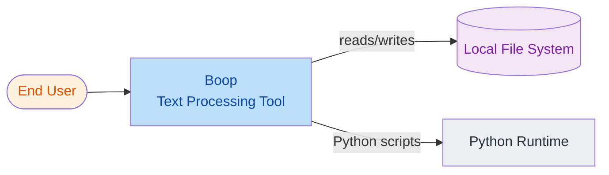
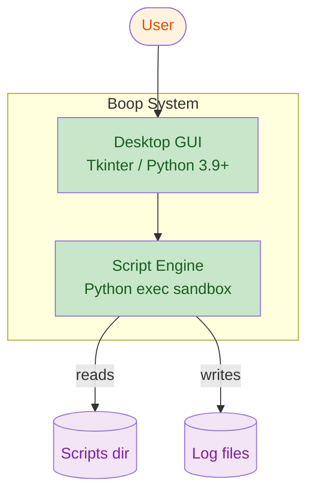
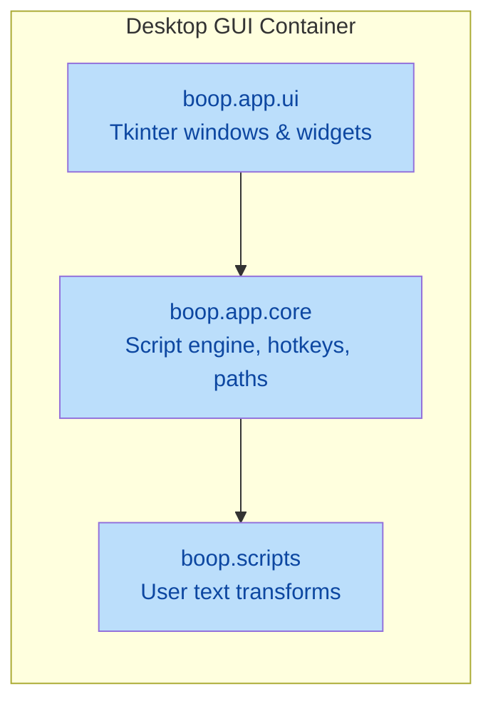
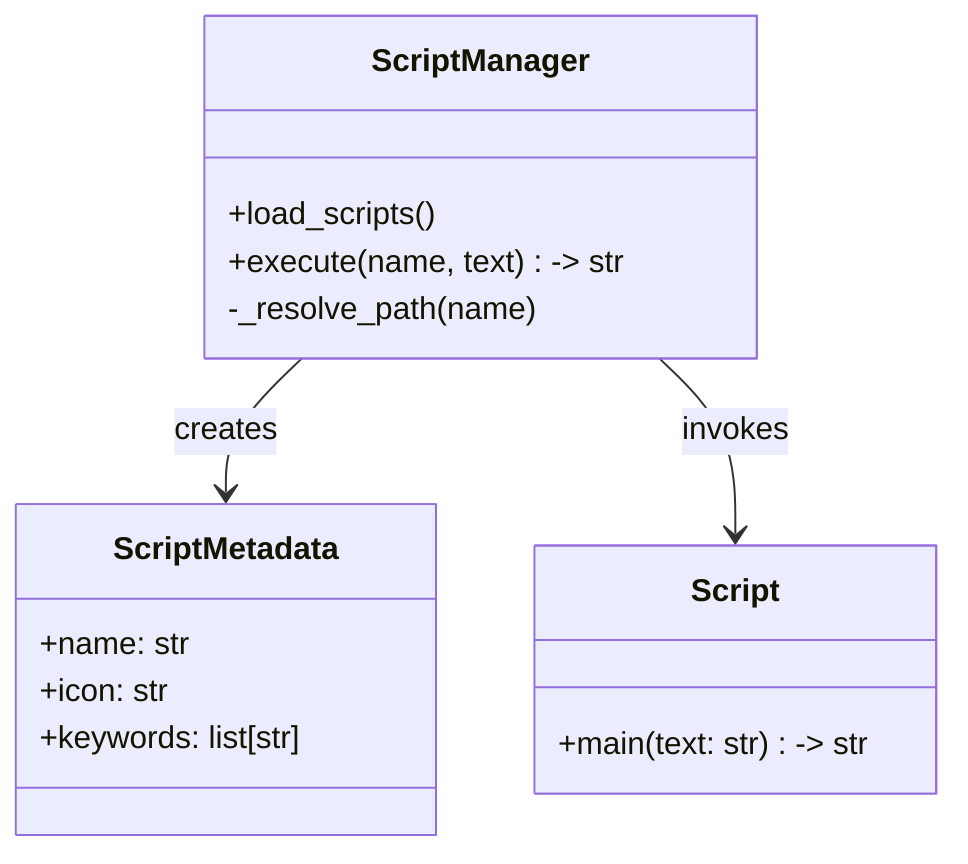

# Python 架构与业务文档生成

本 skill 为 Python 项目产出**入职级技术与业务文档**，组合 **C4 模型**（Context / Containers / Components / Code）与 **ADR**（架构决策记录），并补充 Python 特有分析（打包、依赖管理、类型、异步、测试、可观测性）。

面向主流 Python 工程规范：PEP 517/518/621 打包、`src` 布局、类型注解（PEP 484）、`pyproject.toml` 作为项目清单权威来源、`pytest` 作为默认测试运行器，以及现代工具链（`uv`、`poetry`、`hatch`、`pip-tools`、`ruff`、`mypy`）。

> 本文件已将所有参考与模板合并为单文件，按章节组织。代码标识符、文件名、PEP/STD 引用保持英文；正文随用户语言匹配。

## 何时调用

当用户提出以下需求时触发：

- 为 Python 项目生成架构 / 技术设计文档
- 为新工程师梳理 / 概括 Python 项目以助入职
- 编写业务领域、能力清单、用户旅程
- 为重大技术决策产出 ADR
- 逆向梳理已有 Python 代码库并产出文档
- 在有明确目标架构的前提下，文档化重构方向

**不要**在以下场景调用：单文件脚本、无结构的临时 notebook、纯 bug 修复任务。

## 执行协议

按以下步骤顺序执行。每步引用本文件后续章节的具体说明。

### 步骤 0 — 确认范围与输出位置

通过 `AskUserQuestion`（或文本回退）确认：

1. **范围**：整个项目 vs 某子系统 / 包 vs 基于 `git diff` 的增量。
2. **输出目录**：默认项目根下 `docs/architecture/`，若不存在则创建。
3. **深度**：完整 C4（L1–L4）vs 仅 L1+L2；是否包含 ADR 与入职指南。
4. **语言**：匹配用户最新消息（中文入 → 中文出，英文入 → 英文出）。代码标识符、文件名、PEP 引用保持英文。
5. **文档处理策略**：依据用户偏好，**不删除**既有内容；被取代的小节用 `> [OUTDATED]` 标注，可重组织/补充但不要直接覆盖。

### 步骤 1 — 项目勘察（强制）

动笔前必须先用工具收集证据。**禁止凭想象写文档。**

识别规范信号：

| 信号 | 文件 / 标记 |
|------|-------------|
| 项目清单 | `pyproject.toml`、`setup.py`、`setup.cfg` |
| 依赖锁 | `requirements*.txt`、`uv.lock`、`poetry.lock`、`Pipfile.lock`、`pdm.lock`、`environment.yml` |
| 布局 | `src/<pkg>/`（src 布局）、`<pkg>/`（flat 布局）、含多个 `pyproject.toml` 的 monorepo |
| 入口点 | `[project.scripts]`、`[project.gui-scripts]`、`__main__.py`、`console_scripts`、`if __name__ == "__main__"` |
| 测试布局 | `tests/`、`test/`、`*_test.py`、`test_*.py`、`conftest.py`、`tox.ini`、`noxfile.py` |
| 类型检查 | `mypy.ini`、`.mypy.ini`、`pyrightconfig.json`、`pyproject.toml [tool.mypy]` |
| Lint/format | `ruff.toml`、`.ruff.toml`、`.flake8`、`pyproject.toml [tool.ruff]` |
| 框架 | `asgi.py`/`wsgi.py`（Web）、`manage.py`（Django）、`app.py`（Flask）、`main.py`（FastAPI）、`click`/`typer` 装饰器 |
| 配置 | `.env`、`settings.py`、`config.py`、`pydantic-settings` 的 BaseSettings、`dynaconf`、`python-dotenv` |
| CI/CD | `.github/workflows/`、`.gitlab-ci.yml`、`.circleci/`、`Jenkinsfile`、`azure-pipelines.yml` |
| 容器 | `Dockerfile`、`docker-compose.yml`、`Containerfile` |
| 异步 | `async def`、`asyncio`、`trio`、`anyio`、ASGI 服务器（`uvicorn`、`hypercorn`、`daphne`） |

用 `Glob` 找文件、`Grep` 确认模式、`Read` 抽样阅读。落笔前先在内部整理一份勘察笔记。

### 步骤 2 — 业务概览

产出 `01-overview.md`，覆盖：

- **产品定位** — 一段大白话。
- **业务目标与成功指标** — 系统促成的结果。
- **干系人与用户画像** — 谁用、谁运维。
- **业务能力** — 顶层能力清单（如"用户认证"、"订单处理"）。
- **领域术语表** — 统一语言术语表（术语 | 定义 | 同义词）。
- **范围边界** — 在范围内 vs 明确不在范围。

### 步骤 3 — C4 图

按本文件「附录 A：C4 模型参考」绘制四个层级。使用 **Mermaid** 图（多数代码评审 UI 原生支持）。配色规则：浅底深字、深底浅字。

- **L1 系统上下文** — 系统、外部用户、上下游系统。
- **L2 容器** — 可部署单元（Web 应用、API、worker、CLI、数据库、缓存、对象存储）。对 Python 需区分 WSGI vs ASGI、同步 vs 异步 worker、CLI、调度任务。
- **L3 组件** — 每个容器内的顶层包/子包（如 `routers/`、`services/`、`repositories/`、`models/`）。
- **L4 代码**（可选） — 仅针对热点模块画类图或调用图，谨慎使用。

### 步骤 4 — 模块 / 包映射

产出 `06-module-map.md`：

- 用 `Grep` 扫描 `^from` / `^import` 构建包级导入图。
- 分层检查：识别违规（如 `models` 反向导入 `routers`）。
- 识别：**入口点**、**公共 API 表面**（`__init__.py` 的 `__all__`）、**领域模块**、**基础设施模块**、**适配器**。
- 标注循环导入 — Python 常见坑。

### 步骤 5 — Python 特性分析

产出 `07-python-specifics.md`，以本文件「附录 B：Python 模式检测清单」为检查表，覆盖：

1. **打包与构建**：PEP 621 元数据、构建后端（setuptools / hatchling / flit / poetry-core / pdm-backend）、可编辑安装。
2. **依赖管理**：工具（pip / pip-tools / poetry / pdm / uv / hatch / pipenv / conda）、锁文件策略、版本固定政策。
3. **环境管理**：virtualenv vs venv vs conda vs uv venv；如何复现环境。
4. **类型系统**：类型注解覆盖率、`mypy`/`pyright` 严格度、运行时校验（Pydantic v1 vs v2、dataclasses、attrs、msgspec）。
5. **异步模型**：同步 vs 异步；事件循环（`asyncio` vs `trio` vs `anyio`）；阻塞调用风险；任务队列（Celery、RQ、Dramatiq、ARQ、TaskIQ）。
6. **Web 框架**：Django / Flask / FastAPI / Starlette / aiohttp / Tornado / Litestar — 以及所选服务器（gunicorn、uvicorn、hypercorn、daphne、granian）。
7. **数据层**：ORM（Django ORM、SQLAlchemy 2.x、Tortoise、Peewee、SQLModel）、迁移（Alembic、django-migrations）、NoSQL 驱动、缓存。
8. **CLI**：argparse vs click vs typer vs fire。
9. **配置与密钥**：pydantic-settings、dynaconf、dotenv、vault 集成。
10. **测试**：pytest（插件：pytest-asyncio、pytest-cov、pytest-xdist、hypothesis）、unittest、doctest、tox/nox 矩阵、覆盖率目标。
11. **代码质量**：ruff（lint+format）、black、isort、flake8、pylint；pre-commit 钩子。
12. **可观测性**：日志（`logging`、`structlog`、`loguru`）、指标（prometheus_client）、链路追踪（opentelemetry）、错误追踪（sentry-sdk）。
13. **部署**：Docker 基础镜像（python:slim vs distroless vs uv）、多阶段构建、WSGI/ASGI 服务器、serverless（Lambda、Cloud Functions）、systemd 单元。
14. **安全**：依赖扫描（pip-audit、safety）、密钥扫描（gitleaks）、SAST（bandit、ruff S 规则）。

每项给出现状（附文件证据），再给简短评估（✅ 对齐 / ⚠️ 偏离 / 🔴 风险）。

### 步骤 6 — 数据流文档

产出 `08-data-flow.md`：

- 选 2–5 个代表性用户旅程（如"用户提交订单"、"CLI 处理文件"）。
- 为每个旅程画 **序列图**（Mermaid `sequenceDiagram`）：client → API → service → repository → DB/cache → 外部服务。
- 标注同步/异步边界、事务边界、重试/回退点。

### 步骤 7 — 架构决策记录（ADR）

产出 `docs/architecture/decisions/`，每个决策一个文件，按本文件「附录 C：ADR 模板与示例」撰写。文件命名 `NNNN-short-title.md`（如 `0001-use-fastapi-over-flask.md`）。

至少捕获以下决策：

- Web 框架选型
- 同步 vs 异步
- ORM / 数据访问
- 依赖管理器与锁文件
- 项目布局（src vs flat）
- 测试运行器与覆盖率策略
- 部署拓扑

每个 ADR 必须记录：状态（Proposed / Accepted / Deprecated / Superseded）、上下文、考虑过的方案、决策、后果。

### 步骤 8 — 入职指南

依据本文件「附录 D：输出模板」的入职模板，产出 `10-onboarding.md`：

- 前置条件（Python 版本、OS、系统依赖）。
- 克隆与搭建步骤（按所选工具链创建环境、安装命令）。
- 本地运行（环境变量、热重载）。
- 跑测试（单元、集成、覆盖率报告）。
- Lint / format / type-check 命令。
- 项目结构导览（链接到模块映射）。
- 常见开发任务（加依赖、加端点、加测试）。
- 排错与 FAQ。

### 步骤 9 — 索引与交叉引用

产出 `docs/architecture/README.md` 作为索引页，列出所有产物的一句话说明与链接。被新文档取代的既有小节，用 `> [OUTDATED]` 标注而非删除。

### 步骤 10 — 完成前校验

- 重新通读每个产物；校验路径与链接可达。
- 校验每个框架/工具的论断都有文件证据脚注（如"证据：`pyproject.toml` L12"）。
- 校验图可渲染（Mermaid 语法：`end` 配对、节点 ID 合法）。
- 校验无残留占位文本（如 `TODO`、`TBD`）。

## 输出契约

向用户报告：

- 已生成文件清单（绝对路径，尽量用 `file:///` 链接）。
- 关键发现简述（架构风格、Top 3 风险、Top 3 优势）。
- 建议的后续动作（如"ADR-0007 提议迁移到 `uv`，可考虑在下一个服务上试点"）。

## 文档处理规则（依据用户偏好）

1. **不删除**既有文档内容。重组织时在被取代的小节顶部加 `> [OUTDATED — superseded by <new-section-link> on YYYY-MM-DD]`。
2. **可自由重组织与补充**：合并重复、修正叙述流、补充缺失上下文。
3. 任何 properties / 配置表使用**结构化分组** — 用清晰的小节标题并按相关性分组。
4. **单一事实源**：同一事实出现在多处时，保留在最具体的文档中，其他位置改为链接。
5. **语言**：正文随用户最新消息；代码、标识符、文件路径、PEP/STD 引用保持英文。

## 约束

- **证据驱动**：每个架构论断必须引文件，否则标注为推断。
- **禁止杜撰依赖**：仅列出锁文件或代码中真实存在的包。
- **边界控制**：大型 monorepo 仅文档化请求范围，主动提出可后续扩展。
- **尊重意图**：不主动提议重写代码；本 skill 只做文档，不做重构。
- **保密**：禁止内联在 `.env` 或配置样本中发现的密钥/token/凭据 — 仅以名称引用。

---

## 附录 A：C4 模型参考

C4 模型（Simon Brown）用四个缩放层级描述软件架构。对 Python 项目，各层级自然映射到语言的打包与模块体系。

### A.1 层级映射（Python 视角）

| C4 层级 | Python 单元 | 示例 |
|---------|-------------|------|
| L1 上下文 | 整个系统作为一个盒子 | "Boop — 文本处理桌面应用" |
| L2 容器 | 可部署/可运行单元 | Tkinter GUI 应用、ASGI Web 服务、Celery worker、CLI 脚本、定时任务 |
| L3 组件 | 顶层包或子包 | `boop.app.ui`、`boop.app.core`、`boop.scripts` |
| L4 代码 | 模块 / 类 / 函数 | `editor.py`、`ScriptManager`、`ScriptManager.execute` |

### A.2 Level 1 — 系统上下文

受众：业务与技术干系人。范围：外部参与者与相邻系统。



必备内容：
- 系统占一个盒子。
- 外部人类参与者（带角色标签）。
- 依赖的上游系统与被依赖的下游系统。
- 必要时标注部署上下文（桌面、on-prem、云区域）。

### A.3 Level 2 — 容器

受众：开发者与运维。一个容器 = 一个有独立进程、部署与技术栈的可部署/可运行单元。

Python 常见容器类型：

| 容器类型 | 检测标记 |
|---------|---------|
| 桌面 GUI 应用 | `tkinter`、`PyQt`/`PySide`、`wx`、含 GUI 循环的 `__main__.py`、`.spec`（PyInstaller） |
| WSGI Web 应用 | `gunicorn`/`uwsgi`、`wsgi.py`、Flask `app.run`、Django `runserver` |
| ASGI Web 应用 | `uvicorn`/`hypercorn`/`daphne`、`asgi.py`、FastAPI/Starlette/aiohttp |
| 后台 worker | `celery`、`rq`、`dramatiq`、`arq`、`huey`、`apscheduler` |
| CLI 工具 | `console_scripts` 入口、`click`/`typer` group、`__main__` 中的 `argparse` |
| 定时任务 | cron 定义、`APScheduler`、`daemon` 标志 |
| 库 / SDK | `pyproject.toml` 无入口点；纯可导入包 |



每个容器必备内容：名称、技术（Python 版本 + 框架 + 服务器）、职责、入/出接口、所用数据存储。

### A.4 Level 3 — 组件

受众：开发者。对一个容器下钻。一个组件 = 一个顶层包或内聚子包。



每个组件需记录：用途、公共 API（`__all__`、`__init__.py` 导出）、入向依赖（导入了哪些其他组件）、被谁依赖（谁导入了它）。

### A.5 Level 4 — 代码（可选）

受众：某热点模块的维护者。类图或序列图谨慎使用 — 仅在结构非显然时画。



### A.6 Mermaid 配色规则（无障碍）

- `classDef` 必须同时给 `fill` 与 `color`（文字色）。
- 浅底用深字、深底用浅字。
- 推荐调色板：
  - Actor：`fill:#fff3e0,color:#e65100`
  - System：`fill:#bbdefb,color:#0d47a1`
  - Container：`fill:#c8e6c9,color:#1a5e20`
  - Component：`fill:#f3e5f5,color:#7b1fa2`
  - Store：`fill:#ffecb3,color:#bf360c`
  - External：`fill:#eceff1,color:#263238`
- 单张图节点数控制在 ~15 以内；宁可拆多张图，不要堆挤一张。
- 上下文/容器图优先 `flowchart LR`；组件分解优先 `flowchart TB`。

### A.7 Python 常见需标注的坑

- 同一容器混用 WSGI 与 ASGI 但未显式选定服务器。
- 同步代码调用异步库而未用 `asyncio.run` 或 `anyio` — 常见死锁源。
- `models` / `services` / `routers` 之间的循环导入。
- `__init__.py` 把所有符号全部重导出（公共 API 表面臃肿）。
- 裸 `except:` 或 `except Exception:` 静默吞错。

---

## 附录 B：Python 模式检测清单

在步骤 5（Python 特性分析）中作为检查表使用。每张表给出检测标记与需要在 `07-python-specifics.md` 中记录的内容。

### B.1 项目布局

| 布局 | 标记 | 取舍 |
|------|------|------|
| **src 布局** | `src/<pkg>/__init__.py` | ✅ 推荐。强制安装式导入；避免从 CWD 误导入。 |
| **flat 布局** | 仓库根下 `<pkg>/__init__.py` | 旧库与简单库常见；有遮蔽 stdlib 或 site-packages 的风险。 |
| **monorepo** | 多个 `pyproject.toml` 或 workspace 文件（`pdm.workspace.toml`、`uv.workspace.toml`、hatch 的 `hatch.toml`） | 记录 workspace 工具与成员清单。 |
| **Django 项目** | `manage.py` + `<project>/settings.py` + `apps/` | 文档化 app 列表与 `INSTALLED_APPS`。 |
| **Notebook 项目** | `*.ipynb` + `nbstripout` 配置 | 标注缺乏包结构为风险。 |

需记录：布局类型、根包名、所需 Python 版本（取自 `pyproject.toml` 的 `requires-python` 或 `setup.py` classifiers）。

### B.2 打包与构建后端

检测 `pyproject.toml` 中的 `[build-system]`：

| 后端 | `build-system.requires` 值 | 说明 |
|------|----------------------------|------|
| setuptools | `setuptools >= 61` | 旧默认；兼容广。 |
| hatchling | `hatchling` | 现代；PEP 621 原生。 |
| flit-core | `flit-core >= 3` | 轻量；适合纯 Python 库。 |
| poetry-core | `poetry-core >= 1` | 绑定 poetry 工作流。 |
| pdm-backend | `pdm-backend` | PEP 621 + PEP 582 友好。 |
| setuptools-rust | `setuptools-rust` | Rust/Python 混合扩展。 |
| maturin | `maturin` | Rust 扩展；ABI。 |
| scikit-build-core | `scikit-build-core` | 基于 CMake 的 C/C++/Fortran 扩展。 |

需记录：后端名、声明版本、构建命令（`python -m build`、`hatch build`、`poetry build`、`uv build`）。

### B.3 依赖管理

| 工具 | 锁文件 | 清单 | 说明 |
|------|--------|------|------|
| pip + pip-tools | 由 `requirements.in` 生成的 `requirements.txt` | `.in` 文件 | 通过 `--generate-hashes` 固定哈希。 |
| pip（裸用） | `requirements.txt` | 同上 | 不区分直接与传递依赖。 |
| uv | `uv.lock` | `pyproject.toml` | Rust 实现，极快；锁确定。 |
| poetry | `poetry.lock` | `pyproject.toml [tool.poetry]` | 锁含哈希。 |
| pdm | `pdm.lock` | `pyproject.toml [tool.pdm]` | PEP 582 `__pypackages__` 选项。 |
| hatch | （无锁，依赖固定在 env 中） | `pyproject.toml [tool.hatch.envs]` | 用默认 index。 |
| pipenv | `Pipfile.lock` | `Pipfile` | 较老；无 TOML。 |
| conda / mamba | `environment.yml` / `conda-lock.yml` | 同上 | 记录非 Python 依赖（libgfortran 等）。 |

需记录：工具+版本、锁文件策略（是否提交？是否含哈希？是否 CI 强制？）、dev/test/optional 依赖如何分组（`[project.optional-dependencies]`、`[dependency-groups]`、hatch envs）。

### B.4 环境管理

- `python -m venv`（stdlib）
- `virtualenv`（更快，自带 pip）
- `uv venv`（Rust，极快）
- `conda` / `mamba` / `micromamba`
- `pyenv` / `pyenv-win`（Python 解释器版本）
- `asdf` / `mise` / `rtx`（多语言版本管理器）

需记录：贡献者如何从干净 checkout 复现环境（命令）。

### B.5 类型系统

| 信号 | 含义 |
|------|------|
| `from typing import ...` / PEP 585 `list[str]` / PEP 604 `X \| Y` | 已用类型注解。 |
| `[tool.mypy]` 严格标志（`strict = true`、`disallow_untyped_defs`） | 强制严格类型检查。 |
| `pyrightconfig.json` / `basedpyright` | 基于 Pyright 的检查。 |
| `from pydantic import BaseModel` | 运行时校验；区分 v1（`Config` 类）与 v2（`model_config`）。 |
| `@dataclass`、`from attrs import define` | 轻量值类型。 |
| `TypedDict`、`Protocol`、`Literal`、`Annotated` | 结构化与名义类型组合。 |

需记录：类型检查器配置严格度、Pydantic 版本、注解覆盖率粗估（公共函数带注解比例）。

### B.6 异步模型

| 模式 | 标记 |
|------|------|
| asyncio | `import asyncio`、`async def`、`await` |
| trio | `import trio`、`async with trio.open_nursery()` |
| anyio | `import anyio`（后端无关） |
| 异步 Web | FastAPI、Starlette、Litestar、aiohttp、Sanic、Tornado |
| ASGI 服务器 | `uvicorn`、`hypercorn`、`daphne`、`granian`、`uvloop` |
| 任务队列 | Celery（asyncio 支持有限）、RQ（仅同步）、Dramatiq、ARQ（原生异步）、TaskIQ、Huey |

需标注的隐患：
- 异步函数内做阻塞 I/O（调 `requests`、`time.sleep`、对大文件同步 `open().read()`）而未用 `run_in_executor` / `anyio.to_thread`。
- 在已运行的事件循环里再调 `asyncio.run`。
- Python 3.10 之后还在用 `asyncio.get_event_loop()`（已弃用）。

### B.7 Web 框架

| 框架 | 标记 | 说明 |
|------|------|------|
| Django | `django`、`manage.py`、`settings.py` | MTV；ORM；admin。 |
| Flask | `flask`、`Flask(__name__)` | 默认 WSGI；通过 `flask[async]` 启用异步。 |
| FastAPI | `fastapi`、`FastAPI()`、`@app.get` | ASGI；Pydantic 驱动。 |
| Starlette | `starlette`、`Starlette()` | ASGI；FastAPI 的基座。 |
| Litestar | `litestar`、`Litestar()` | ASGI；前身 Starlette。 |
| aiohttp | `aiohttp.web` | ASGI 风格；原生异步。 |
| Tornado | `tornado.web` | 旧异步；历史上非 asyncio 循环。 |
| Bottle | `bottle`、`route('/')` | 微型 WSGI。 |
| Sanic | `sanic` | ASGI；原生异步。 |

服务器（WSGI/ASGI）：

| 服务器 | 标记 |
|--------|------|
| gunicorn | `gunicorn`、配置 `gunicorn.conf.py` |
| uwsgi | `uwsgi`、`.ini` 文件 |
| uvicorn | `uvicorn`、`--workers`、`--loop uvloop` |
| hypercorn | `hypercorn`、`--worker-class` |
| daphne | `daphne`、Django Channels |
| granian | `granian`、基于 Rust |

### B.8 数据层

| ORM / 库 | 标记 |
|----------|------|
| Django ORM | `django.db.models` |
| SQLAlchemy 2.x | `sqlalchemy`、`Mapped`、`mapped_column`、`Session` |
| SQLAlchemy 1.x | `Column`、`sessionmaker`、`query()` |
| SQLModel | `sqlmodel`、`SQLModel`（Pydantic + SQLAlchemy） |
| Tortoise ORM | `tortoise`、`Tortoise.init` |
| Peewee | `peewee`、`Model` |
| PonyORM | `pony.orm`、`db_session` |
| 原生驱动 | `psycopg`（v3）/ `psycopg2`、`asyncpg`、`mysql-connector`、`pyodbc`、`aiosqlite`、`sqlalchemy[asyncio]` |
| NoSQL | `motor`（Mongo 异步）、`pymongo`、`redis`、`aioredis`（已弃用，改用 `redis[asyncio]`）、`cassandra-driver`、`pynamodb` |

迁移：Alembic（`alembic.ini`、`versions/`）、Django migrations（`migrations/`）、yoyo-migrations、裸 SQL。

缓存：`functools.lru_cache`、`cachetools`、`aiocache`、`diskcache`、Redis、Memcached。

### B.9 CLI 框架

| 工具 | 标记 | 说明 |
|------|------|------|
| argparse | `argparse.ArgumentParser` | stdlib；啰嗦但随时可用。 |
| click | `click.group()`、`@click.option` | 装饰器风格；同步优先。 |
| typer | `typer.Typer()` | 基于 click；Pydantic 风格类型。 |
| fire | `fire.Fire()` | 把任意对象自动变 CLI。 |
| rich-click | `rich_click` | 美化 help 输出。 |

需记录：`[project.scripts]` 中的入口点名称。

### B.10 配置与密钥

| 工具 | 标记 |
|------|------|
| pydantic-settings | `BaseSettings`、`SettingsConfigDict` |
| dynaconf | `dynaconf.Dynaconf` |
| python-dotenv | `load_dotenv()` |
| configparser / tomllib | stdlib 配置读取器 |
| environs | `env.*` 访问器 |
| 直接 `os.environ` | |

需标注：`.env` 中提交了密钥（且无 `.gitignore` 保护）、`settings.py` 字面量里出现密钥。

### B.11 测试

| 运行器 | 标记 |
|--------|------|
| pytest | `conftest.py`、`test_*.py`、`pytest.ini` / `[tool.pytest.ini_options]` |
| unittest | `unittest.TestCase`、`python -m unittest` |
| tox | `tox.ini` |
| nox | `noxfile.py` |
| hatch envs | `[tool.hatch.envs.test]` |
| pytest 插件 | `pytest-asyncio`、`pytest-cov`、`pytest-xdist`、`pytest-mock`、`pytest-benchmark`、`hypothesis` |

需记录：测试布局、fixture 策略（`conftest.py` 位置）、覆盖率目标（`--cov-fail-under`）、CI 矩阵（Python 版本、OS）。

### B.12 代码质量

| 工具 | 标记 |
|------|------|
| ruff | `[tool.ruff]`、`ruff.toml`（lint + format，替代 flake8 + isort + black） |
| black | `[tool.black]` |
| isort | `[tool.isort]` |
| flake8 | `.flake8` |
| pylint | `.pylintrc` / `[tool.pylint]` |
| pyupgrade | pre-commit 钩子 |
| pre-commit | `.pre-commit-config.yaml` |

需记录：配置的规则、行宽、导入排序策略、pre-commit 钩子列表。

### B.13 可观测性

| 关注点 | 库 |
|--------|----|
| 日志 | `logging`（stdlib）、`structlog`、`loguru`、`picologging` |
| 指标 | `prometheus-client`、`opentelemetry-api`、`starlette-exporter` |
| 链路追踪 | `opentelemetry-sdk`、`opentelemetry-instrumentation-*`、`ddtrace`、`newrelic` |
| 错误追踪 | `sentry-sdk` |
| 性能分析 | `py-spy`、`scalene`、`austin`、`cProfile`/`yappi` |

需标注：生产代码路径用 print 做诊断；日志无结构化上下文；异步边界缺 correlation ID。

### B.14 部署

| 目标 | 标记 |
|------|------|
| Docker / OCI | `Dockerfile`、`docker-compose.yml`、基础镜像（python:slim、distroless、uv、nixpacks） |
| WSGI | gunicorn、uwsgi、waitress |
| ASGI | uvicorn、hypercorn、daphne、granian |
| Serverless | AWS Lambda handler（`def lambda_handler`）、GCP Functions、Azure Functions |
| PaaS | `Procfile`、`runtime.txt`、`app.json` |
| 原生安装包 | PyInstaller（`.spec`）、cx_Freeze、Nuitka、Briefcase |
| systemd | `.service` 单元文件 |

需标注：镜像 > ~500 MB；用 root 用户；缺 `.dockerignore`；多架构考虑（`platforms=linux/amd64,linux/arm64`）。

### B.15 安全

| 关注点 | 工具 | 标记 |
|--------|------|------|
| 依赖漏洞扫描 | pip-audit、safety、osv-scanner | CI 任务或 pre-commit |
| 密钥扫描 | gitleaks、trufflehog、detect-secrets | pre-commit + CI |
| SAST | bandit、ruff `S` 规则、semgrep | 配置 + baseline |
| 运行时类型安全 | pydantic、typeguard、beartype | |
| AuthN/Z | Authlib、python-jose、pyjwt、FastAPI `Depends`、Django auth | |

### B.16 记录格式

`07-python-specifics.md` 的每一节按下式输出：

```
### N. <分类>

**现状：** <一句话陈述>
**证据：** <file:line 或标记>
**评估：** ✅ 对齐 / ⚠️ 偏离 / 🔴 风险 — <一句话理由>
**建议（仅当偏离/风险）：** <一句话行动>
```

仅评估行必填；证据与建议在适用时给出。

---

## 附录 C：ADR 模板与示例

**架构决策记录**（ADR）捕获单个决策及其上下文、备选方案与后果。ADR 是版本化的，一旦 Accepted 即不可变（用新 ADR 取而代之），以纯 Markdown 存储。

参考：Michael Nygard 的原始 ADR 模式（<https://cognitect.com/blog/2011/11/15/documenting-architecture-decisions>）。

### C.1 文件命名

`docs/architecture/decisions/NNNN-kebab-case-title.md`

- `NNNN`：从 `0001` 起的零填充序号。
- 标题：简短、决策导向（如 `use-uv-for-dependency-management`、`adopt-fastapi-over-flask`）。
- 序号**永不复用**。取代性决策取下一个空号并回链被取代的 ADR。

### C.2 状态

| 状态 | 含义 |
|------|------|
| `Proposed` | 已起草，待评审。 |
| `Accepted` | 已批准，现约束力。 |
| `Deprecated` | 不再相关；不要遵循。 |
| `Superseded` | 被后续 ADR 取代（需链接）。 |
| `Rejected` | 考虑后否决（留档）。 |

状态变更采用追加方式：不重写历史。在文件底部加 `## Change Log` 小节，记录日期 + 作者 + 状态迁移。

### C.3 模板

```markdown
# NNNN. <决策标题>

- **Status:** Proposed | Accepted | Deprecated | Superseded | Rejected
- **Date:** YYYY-MM-DD
- **Deciders:** <姓名或角色>
- **Supersedes:** <ADR-XXXX，若有>
- **Superseded by:** <ADR-YYYY，若有>

## Context（上下文）

我们面临什么问题？有哪些力量（技术、业务、进度、团队技能、合规）
在起作用？陈述问题，不要陈述方案。

纳入事实：库版本、规模估算、合规约束、上下游耦合。尽量引用证据
（文件、链接、指标）。

## Decision Drivers（决策驱动因素）

- <驱动 1，如"P99 延迟 < 200 ms">
- <驱动 2，如"团队已熟悉框架 X">
- <驱动 3，如"避免厂商锁定">

## Options Considered（考虑过的方案）

### Option A: <名称>

- **Pros:** ...
- **Cons:** ...
- **Cost / effort:** ...
- **Risk:** ...

### Option B: <名称>

- **Pros:** ...
- **Cons:** ...
- **Cost / effort:** ...
- **Risk:** ...

### Option C: <名称>

（同结构。）

## Decision（决策）

选择 **<Option X>**，因为 <绑定驱动因素的简短理由>。

## Consequences（后果）

- **Positive:** ...
- **Negative:** ...
- **Neutral / trade-off accepted:** ...
- **Action items:**（谁在何时前做什么 — 可选）
- **Retro trigger:** 在何种条件下应重新审视本 ADR？

## Compliance（合规）

如何验证决策被遵循？

- Lint 规则 / pre-commit 钩子：...
- 评审 checklist 项：...
- 架构测试（如 import-linter 契约）：...

## Change Log

- YYYY-MM-DD: Status Proposed → Accepted（决策者姓名）。
```

### C.4 示例（Python 场景，仅作示例不具约束力）

#### 示例 1 — Web 框架选型

```markdown
# 0001. 采用 FastAPI 作为主力 Web 框架

- **Status:** Accepted
- **Date:** 2026-08-01
- **Deciders:** 后端负责人、平台团队

## Context

新订单服务需要 HTTP API。现有服务用 Flask（同步）。新产品功能需要流式
响应与 WebSocket 推送。

## Decision Drivers

- 上游 HTTP 与 Postgres 调用需要异步 I/O。
- 想要一流的 Pydantic v2 校验。
- 团队熟悉 Starlette 概念。
- 部署足迹要精简（单容器）。

## Options Considered

### Option A: Flask + Flask[async]
- Pros: 熟悉。
- Cons: 异步是补丁；无原生 Pydantic 集成。

### Option B: FastAPI
- Pros: ASGI 原生、Pydantic v2、内置 OpenAPI。
- Cons: 比 Flask 新；团队有 ramp-up 成本。

### Option C: Litestar
- Pros: 更强的类型钩子、插件。
- Cons: 社区更小；招聘熟悉度低。

## Decision

选 FastAPI。驱动对齐：异步 I/O + Pydantic v2 + 团队对 Starlette 的熟悉度。

## Consequences

- Positive: 端到端异步 I/O，自动 OpenAPI 文档。
- Negative: 对同步熟练的工程师是新模式；需要培训计划。
- Action items: 结对编程、内部 `fastapi-kit` 模板。
- Retro trigger: 若 6 个月后 > 50% 的端点仍是 sync-with-asyncio.run，则重新审视。

## Compliance

- `import-linter` 契约禁止 `src/orders/` 中出现 `flask` 导入。
- PR 模板勾选项："端点是否默认 async，除非证明必要？"
```

#### 示例 2 — 依赖管理器

```markdown
# 0002. 采用 uv 管理依赖

- **Status:** Accepted
- **Date:** 2026-08-01
- **Deciders:** 平台团队

## Context

CI 安装时间已涨到 ~6 分钟，因传递依赖图庞大。pip-tools 工作流对新贡献者
不易上手。

## Decision Drivers

- 加速 CI 依赖解析与安装。
- 单工具覆盖 env + lock + sync。
- 含哈希的可重现安装。

## Options Considered

### Option A: poetry
- Pros: 成熟、知名。
- Cons: 解析器较慢；锁格式不可互操作。

### Option B: uv
- Pros: 数量级更快、基于 Rust、PEP 621 原生。
- Cons: 更年轻；存在轻微生态漂移。

### Option C: pdm
- Pros: PEP 582、特性成熟。
- Cons: 团队与 uv 势头比偏小。

## Decision

采用 uv。生成 `uv.lock`；CI 跑 `uv sync --frozen`。

## Consequences

- Positive: CI 安装从 ~6 min 降至 ~30 s。
- Negative: 锁文件格式不可移植到 pip 工作流；文档化 `uv export` 作为回退。
- Action items: 更新 onboarding 文档；devcontainer 加 `uv`。
```

### C.5 ADR 索引

维护 `docs/architecture/decisions/README.md` 作为表格：

```markdown
| # | 标题 | 状态 | 日期 |
|---|------|------|------|
| 0001 | 采用 FastAPI | Accepted | 2026-08-01 |
| 0002 | 采用 uv | Superseded by 0007 | 2026-08-01 |
| 0007 | 迁移到 uv workspace | Accepted | 2026-09-10 |
```

新增 ADR 或状态变更时同步更新该索引。

---

## 附录 D：输出模板

下列模板供生成产物时参考，所有 `<...>` 占位符需替换为项目实际内容。

### D.1 业务概览模板（`01-overview.md`）

```markdown
# <项目名> — 架构与业务概览

> 由 `python-arch-doc` skill 生成。替换 `<...>` 占位符为项目实际内容。

## 1. 产品定位

<一段大白话描述系统做什么、服务谁。>

## 2. 业务目标与成功指标

| 目标 | 指标 | 目标值 | 数据来源 |
|------|------|--------|----------|
| <如：降低文本处理摩擦> | <首次处理耗时> | <30 s> | <分析数据源> |

## 3. 干系人与用户画像

| 画像 | 角色 | 目标 | 痛点 |
|------|------|------|------|
| <姓名> | <角色> | <目标> | <痛点> |

## 4. 业务能力

- **CAP-1** <能力名> — <一句话描述>
- **CAP-2** <能力名> — <一句话描述>

## 5. 领域术语表（统一语言）

| 术语 | 定义 | 同义词 |
|------|------|--------|
| <术语> | <定义> | <别名> |

## 6. 范围边界

**范围内：**
- <项>

**范围外：**
- <项>

## 7. 关联文档

- [C4 系统上下文](./02-c4-context.md)
- [容器图](./03-c4-containers.md)
- [组件图](./04-c4-components.md)
- [模块映射](./06-module-map.md)
- [Python 特性分析](./07-python-specifics.md)
- [数据流](./08-data-flow.md)
- [ADR](./decisions/README.md)
- [入职指南](./10-onboarding.md)
```

### D.2 模块映射模板（`06-module-map.md`）

```markdown
# <项目名> — 模块与包映射

> 由 `python-arch-doc` skill 生成。替换 `<...>` 占位符。

## 1. 顶层布局

<repo root>/
├── pyproject.toml          # 清单（build-system、依赖、工具配置）
├── src/<package>/          # 或根下 <package>/（flat 布局）
│   ├── __init__.py
│   ├── <module>.py
│   └── <subpackage>/
└── tests/

**布局类型：** `src` | `flat` | `monorepo`
**根包：** `<package>`
**所需 Python：** `<3.x>`（证据：`pyproject.toml` 的 `requires-python`）

## 2. 包目录

| 包 / 模块 | 用途 | 公共 API（`__all__`） | 入向依赖 | 被谁依赖 |
|-----------|------|------------------------|----------|----------|
| `<package>.<sub>` | <一句话> | <导出> | <导入> | <谁导入它> |

## 3. 分层

目标分层（上层依赖下层，禁止反向）：

1. **入口 / 接口** — `cli/`、`ui/`、`routers/`、`__main__.py`
2. **应用 / 用例** — `services/`、`use_cases/`
3. **领域** — `models/`、`domain/`、`entities/`
4. **基础设施** — `repositories/`、`adapters/`、`db/`、`clients/`

### 分层违规

| From → To | 严重度 | 建议修复 |
|-----------|--------|----------|
| `<pkg>.models → <pkg>.routers` | 🔴 严重 | <修复> |

（无违规则留空。）

## 4. 循环导入

| 循环 | 触发方式 | 建议修复 |
|------|----------|----------|
| `<A> → <B> → <A>` | <如何暴露> | <抽公共模块 / 懒加载> |

（无则留空。）

## 5. 入口点

| 名称 | 类型 | 位置 | 框架 |
|------|------|------|------|
| `<entry>` | CLI / GUI / WSGI / ASGI / worker | `<file>:<line>` | click / typer / FastAPI / ... |

## 6. 公共 API 表面

顶层 `__init__.py` 重导出的模块：

<package>/__init__.py
__all__ = ["<symbol>", "<symbol>"]

标注：`__all__` 列表过大（>30 个符号） — 考虑收窄公共 API。

## 7. 外部依赖足迹

| 依赖 | 版本（取自锁） | 使用广度 | 在关键路径？ |
|------|-----------------|----------|--------------|
| `<pkg>` | `<x.y.z>` | <导入点数> | yes / no |

由 `pyproject.toml` + 在 `src/` 上 Grep `^import|^from` 得到。
```

### D.3 数据流模板（`08-data-flow.md`）

```markdown
# <项目名> — 数据流

> 由 `python-arch-doc` skill 生成。替换 `<...>` 占位符。选 2–5 个代表性旅程，不要试图覆盖所有流。

## Journey 1: <如：用户提交文本处理>

### 参与者
- User
- GUI / CLI
- 脚本引擎
- 文件系统

### 序列图

sequenceDiagram
    participant U as User
    participant UI as GUI (tkinter)
    participant SE as Script engine
    participant FS as Scripts dir
    U->>UI: 选中文本，按快捷键
    UI->>SE: execute(script_name, text)
    SE->>FS: 加载并 exec 脚本
    FS-->>SE: 处理结果
    SE-->>UI: 返回处理后文本
    UI-->>U: 替换选区

### 标注
- 同步/异步边界：<全同步 | 第 N 步起异步>
- 事务边界：<无 | 第 X 步包在事务里>
- 重试/回退：<无 | 最多重试 3 次，带退避>
- 缓存：<无 | 按输入缓存结果>

---

## Journey 2: <如：CLI 处理批量文件>

<同结构>

---

## Journey 3: <如：后台 worker 消费队列>

<同结构 — 含队列 + worker + 下游服务>

---

## 横切观察

- **关键路径：** <哪个旅程在用户感知性能的关键路径上>
- **失败模式：** <第 X 步失败会怎样>
- **可观测性缺口：** <哪些旅程缺指标/追踪>
```

### D.4 入职指南模板（`10-onboarding.md`）

```markdown
# <项目名> — 新人入职指南

> 由 `python-arch-doc` skill 生成。替换 `<...>` 占位符。假设从干净机器的干净克隆开始。

## 1. 前置条件

| 要求 | 版本 | 检查命令 |
|------|------|----------|
| Python | `<3.x>` | `python --version` |
| OS | macOS / Linux / Windows | — |
| 系统依赖 | <如 Tk "8.6+"、libpq、libxml2> | `<command>` |
| 工具链 | <uv / poetry / pdm / pip> | `<tool> --version` |

## 2. 克隆与搭建

git clone <repo-url>
cd <repo>

### 创建环境并安装依赖

按 `07-python-specifics.md` 检测到的工具链选择对应块：

**uv（现代首选）：**
uv sync
source .venv/bin/activate   # macOS / Linux
.venv\Scripts\activate       # Windows

**poetry：**
poetry install
poetry shell

**pip + venv（回退）：**
python -m venv .venv
source .venv/bin/activate
pip install -e ".[dev,test]"

## 3. 本地运行

# Web 服务
<uvicorn src.app:app --reload>     # FastAPI / Starlette
<gunicorn src.wsgi:app>             # Flask / Django WSGI

# CLI
python -m <package>                 # 通过 __main__.py 的入口
<entry-name> --help                 # console_scripts 入口

# GUI / 桌面
python -m <package>

所需环境变量（从 `.env.example` 复制）：

cp .env.example .env
# 填入 <KEY>=<value>

## 4. 跑测试

# pytest（默认）
pytest                              # 全部
pytest tests/<dir>                  # 子集
pytest -k "<expression>"            # 按名过滤
pytest --cov=<package> --cov-report=html
open htmlcov/index.html

矩阵运行器：

tox                # 或：nox

覆盖率目标：`<%>`（通过 `--cov-fail-under=<%>` 强制）。

## 5. 代码质量

ruff check .                       # lint
ruff format .                      # format（或：black .）
mypy src/                          # 类型检查
pre-commit run --all-files         # 全部钩子

## 6. 项目结构

详见 [模块映射](./06-module-map.md)。速览：

<repo>/
├── src/<package>/     # 生产代码
│   ├── <ui|cli|api>/  # 入口 / 接口层
│   ├── <services>/    # 应用层
│   ├── <models>/      # 领域层
│   └── <db|clients>/  # 基础设施层
└── tests/

## 7. 常见开发任务

### 加运行时依赖

uv add <package>                   # uv
poetry add <package>                # poetry
# 然后跑测试并提交 uv.lock / poetry.lock

### 加新端点 / 命令 / 文本处理

1. 在对应层加文件（见模块映射）。
2. 若是公共符号，加入 `__all__`。
3. 在 `tests/` 下镜像源路径加测试。
4. 跑 `ruff check --fix && mypy && pytest`。

### 加新 ADR

# 复制本 skill 附录 C 的模板
cp docs/architecture/decisions/_template.md docs/architecture/decisions/$(printf "%04d" $(( $(ls docs/architecture/decisions/ | tail -n 1 | cut -c1-4) + 1 )))-short-title.md

随后更新 `docs/architecture/decisions/README.md` 索引。

## 8. 排错

| 症状 | 可能原因 | 修复 |
|------|----------|------|
| `ModuleNotFoundError: No module named '<pkg>'` | 忘了 `pip install -e .` / 不在 venv | `uv sync` / 激活 venv |
| `RuntimeError: asyncio.run() cannot be called from a running event loop` | 嵌套 `asyncio.run` | 用 `await` 或 `anyio.run` |
| Pydantic `UserWarning: <X> has changed in Pydantic v2` | v1→v2 迁移漂移 | 见 ADR-XXXX 的迁移指南 |
| `<tool> not found` | 工具链未安装 | 按 toolchain 文档装 `uv` / `poetry` |

## 9. FAQ

**Q: 如何升级依赖？**
A: `<uv lock --upgrade | poetry update>` 然后跑测试。

**Q: 本地该用哪个 Python 版本？**
A: `requires-python` 中的最低版本。用 `pyenv` / `uv python install` 管理版本。

**Q: 在哪报 bug / 提需求？**
A: `<issue tracker 链接>`。

## 10. 下一步

- 阅读 [架构概览](./01-overview.md)。
- 浏览 [C4 系统上下文](./02-c4-context.md) 建立大局观。
- 看最近 [ADR](./decisions/README.md) 了解当前方向。
```
