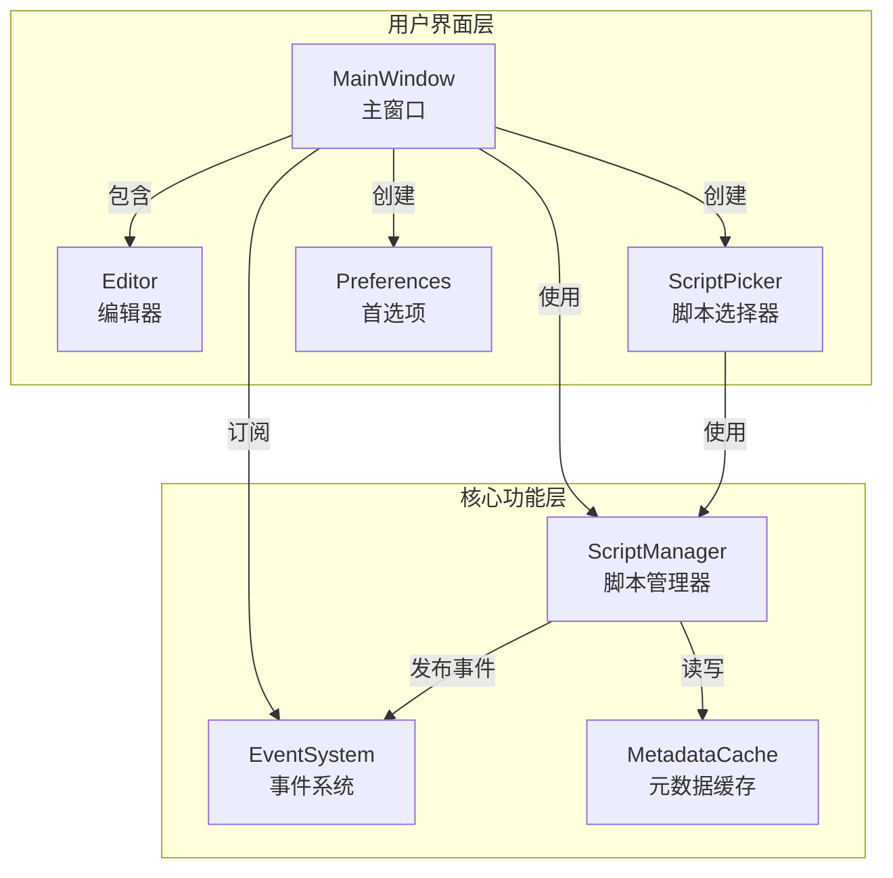

# Boop Python 技术设计文档

## 1. 设计原则

- **保持简洁**：避免过度设计
- **模块化**：独立模块，易于维护
- **性能优先**：优化关键路径
- **可读性**：清晰命名和结构

## 2. 系统架构

### 2.1 目录结构

```
boop/
├── __main__.py          # 应用入口
├── config/
│   └── settings.py      # 配置管理 (BoopConfig)
├── core/
│   ├── script.py        # 脚本管理器
│   ├── script_metadata.py # 元数据解析
│   ├── script_wrapper.py # 执行包装器
│   ├── cache.py         # 元数据缓存
│   ├── event.py         # 事件系统
│   ├── logging.py       # 日志管理
│   ├── path.py          # 路径管理
│   └── utils.py         # 工具函数
├── ui/
│   ├── main.py          # 主窗口
│   ├── editor.py        # 编辑器组件
│   ├── script_picker.py # 脚本选择器
│   └── preferences.py   # 首选项窗口
└── scripts/             # 内置脚本
```

### 2.2 模块关系



## 3. 核心组件

### 3.1 事件系统

发布 - 订阅模式，组件间通信：

```python
# 事件类型
scripts_loaded           # 脚本加载完成
script_load_error        # 脚本加载失败
script_execution_started # 脚本执行开始
script_execution_completed # 脚本执行完成
```

### 3.2 脚本管理器

```python
class ScriptManager:
    def load_metadata(self) -> int      # 加载元数据
    def get_all_metadata(self) -> dict  # 获取所有元数据
    def refresh_metadata_cache(self)    # 刷新缓存
```

### 3.3 元数据缓存

- 缓存位置：`~/Library/Caches/boop/metadata.json` (macOS)
- 缓存内容：脚本元数据字典
- 缓存更新：脚本文件修改时自动更新

### 3.4 脚本执行

```python
# script_wrapper.py
class ScriptExecution:
    def __init__(self, text, full_text, selection)
    def insert(self, text)
    def post_info(self, msg)
    def post_error(self, msg)
```

**执行流程：**

1. 用户选择脚本
2. 主窗口发布 `script_execution_started` 事件
3. 在子进程中执行脚本
4. 脚本完成后更新编辑器内容
5. 发布 `script_execution_completed` 事件

## 4. UI 组件

### 4.1 主窗口 (MainWindow)

- 创建菜单栏（Boop/Edit/Script/Help）
- 初始化 Editor、ScriptManager
- 绑定全局快捷键
- 订阅系统事件

### 4.2 编辑器 (Editor)

- `tk.Text` 组件 + 行号显示
- 撤销/重做历史管理
- 多光标编辑支持
- 字体动态更新

### 4.3 脚本选择器 (ScriptPicker)

- 搜索框（支持名称和标签搜索）
- 脚本列表（Treeview）
- 详细信息面板
- 防抖搜索（可配置延迟）

### 4.4 首选项 (PreferencesPanel)

- **General**：窗口大小、字体
- **Scripts**：脚本目录、Python 解释器、依赖管理
- **Logs**：日志查看和清除

## 5. 配置系统

### 5.1 BoopConfig 数据类

```python
@dataclass
class BoopConfig:
    script_directories: List[str]
    python_path: str
    font_family: str
    font_size: int
    window_width: int
    window_height: int
    maximize_window: bool
    shortcuts: Dict[str, List[str]]
    script_timeout: int
    filter_delay: int
```

### 5.2 配置存储

- 文件位置：`~/Library/Application Support/boop/config.json` (macOS)
- 加载方式：启动时自动加载
- 保存方式：首选项窗口保存时写入

## 6. 脚本系统

### 6.1 脚本结构

```python
'''
{
    "name": "脚本名称",
    "description": "功能描述",
    "tags": ["标签"],
    "icon": "★",
    "help": "使用说明",
    "dependencies": ["requests"]
}
'''

def main(state):
    text = state.text
    state.text = text.upper()
```

### 6.2 元数据字段

| 字段 | 类型 | 说明 |
|------|------|------|
| `name` | string | 脚本名称 |
| `description` | string | 功能描述 |
| `tags` | list | 搜索标签 |
| `icon` | string | 图标 |
| `help` | string | 帮助说明 |
| `dependencies` | list | 依赖包列表 |

### 6.3 state API

| 属性/方法 | 说明 |
|-----------|------|
| `state.text` | 获取/设置当前文本 |
| `state.full_text` | 获取/设置全部内容 |
| `state.selection` | 获取/设置选中文本 |
| `state.insert(text)` | 在光标处插入 |
| `state.post_info(msg)` | 显示提示 |
| `state.post_error(msg)` | 显示错误 |

### 6.4 依赖管理

1. 脚本元数据中定义 `dependencies`
2. 首选项 → Scripts → Install All Dependencies
3. 使用 pip 安装到应用内部环境

## 7. 日志系统

### 7.1 日志配置

```python
# 日志级别
开发环境：DEBUG
打包应用：INFO

# 日志文件
macOS: ~/Library/Logs/boop/boop.log
Windows: %APPDATA%/boop/logs/boop.log
Linux: ~/.config/boop/logs/boop.log

# 轮转设置
单文件大小：5MB
备份数量：3
```

### 7.2 日志格式

```
2026-03-07 19:42:51 - b.u.main - INFO - 消息内容
```

路径缩写：`boop.ui.main` → `b.u.main`

## 8. 打包部署

### 8.1 PyInstaller 配置

```bash
./build.sh
```

**输出：**
- macOS: `dist/Boop-*.dmg`
- Linux: `dist/Boop-*.tar.gz`
- Windows: `dist/Boop-*.zip`

### 8.2 打包内容

- 应用主程序
- Python 运行时
- 依赖库
- 内置脚本
- 用户文档 (USER_GUIDE.md)

### 8.3 环境检测

```python
# 检测打包环境
def is_packaged_app():
    return getattr(sys, 'frozen', False) or hasattr(sys, '_MEIPASS')
```

## 9. 性能优化

### 9.1 脚本加载

- 元数据缓存（JSON 文件）
- 后台异步加载
- 增量更新

### 9.2 界面响应

- 使用 `after` 异步更新
- 搜索防抖（可配置延迟）
- 事件驱动更新

### 9.3 脚本执行

- 子进程隔离
- 超时保护（默认 30 秒）
- 进程池复用

## 10. 扩展性

### 10.1 添加新脚本

1. 创建 Python 文件
2. 添加元数据 docstring
3. 实现 `main(state)` 函数
4. 将文件放入脚本目录

### 10.2 添加新功能

1. 在 `core/` 添加核心逻辑
2. 在 `ui/` 添加界面组件
3. 使用事件系统通信
4. 在 `MainWindow` 中集成
