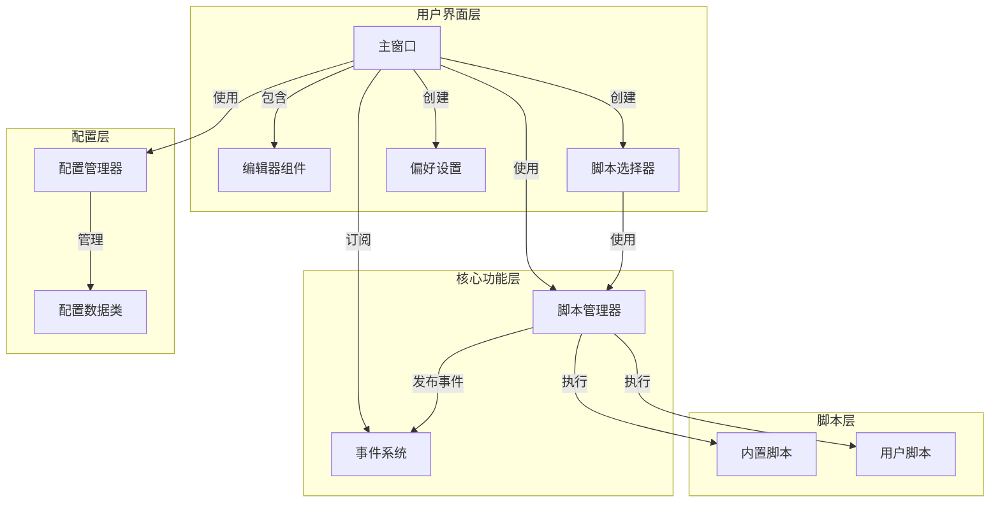
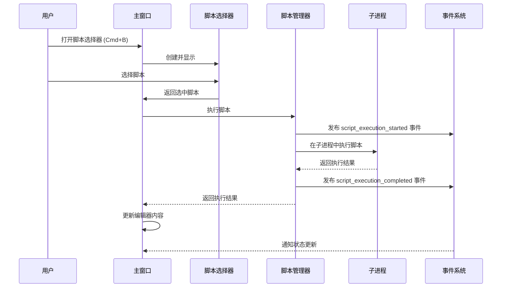
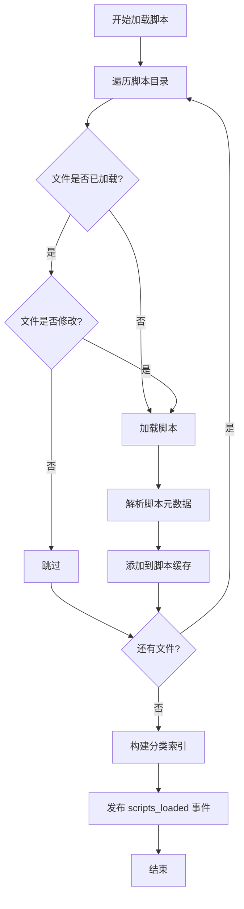

# Boop Python 详细设计文档

## 1. 设计原则

- **保持简洁**：避免过度设计，使用简单直接的代码实现功能
- **模块化**：将功能拆分为独立的模块，提高代码可维护性
- **性能优先**：优化关键路径，确保应用响应迅速
- **可读性**：使用清晰的命名和结构，便于理解和维护

## 2. 项目概述

Boop Python 是一个文本处理工具，灵感来自 Boop macOS 应用。它允许用户通过执行脚本对文本进行各种操作，如格式化、转换、分析等。

### 2.1 核心功能

- 单窗口文本编辑器，支持行号显示和语法高亮
- 脚本执行系统，在隔离的子进程中运行脚本
- 脚本选择器，支持脚本分类和搜索
- 撤销/重做功能
- 状态栏显示（行号、列号、字符数）
- 主题支持（浅色/深色）
- 配置管理

### 2.2 技术栈

- **语言**: Python 3
- **GUI 库**: Tkinter
- **并发**: ProcessPoolExecutor（用于脚本执行）
- **事件系统**: 自定义发布-订阅模式
- **脚本执行**: 子进程隔离执行

## 3. 系统架构

### 3.1 目录结构

```
boop/
├── __init__.py
├── __main__.py         # 应用入口
├── config/             # 配置相关
│   ├── __init__.py
│   └── settings.py
├── core/               # 核心功能
│   ├── __init__.py
│   ├── event.py        # 事件系统
│   ├── script.py       # 脚本管理
│   └── utils.py        # 通用工具
├── scripts/            # 内置脚本
├── ui/                 # 用户界面
│   ├── __init__.py
│   ├── editor.py       # 编辑器组件
│   ├── main.py         # 主窗口
│   ├── preferences.py  # 偏好设置
│   ├── script_picker.py # 脚本选择器
│   └── icons/           # 图标目录
└── config.json         # 配置文件
```

### 3.2 模块职责

| 模块 | 主要职责 | 文件位置 |
|------|---------|----------|
| main | 应用入口 | boop/__main__.py |
| config | 配置管理 | boop/config/settings.py |
| event | 事件系统 | boop/core/event.py |
| script | 脚本加载和执行 | boop/core/script.py |
| utils | 通用工具 | boop/core/utils.py |
| editor | 编辑器组件 | boop/ui/editor.py |
| main_window | 主窗口 | boop/ui/main.py |
| script_picker | 脚本选择器 | boop/ui/script_picker.py |
| preferences | 偏好设置 | boop/ui/preferences.py |
| icons | 图标存储 | boop/ui/icons/ |

### 3.3 架构图



## 4. 核心功能设计

### 4.1 事件系统

事件系统采用发布-订阅模式，用于组件间通信：

```python
# 核心事件系统结构
class EventSystem:
    def subscribe(self, event_name, callback):
        # 订阅事件
        pass
    
    def publish(self, event_name, *args, **kwargs):
        # 发布事件给所有订阅者
        pass

# 全局事件系统实例
event_system = EventSystem()
```

#### 4.1.1 事件类型

| 事件名称 | 触发时机 | 携带数据 |
|---------|---------|----------|
| scripts_loaded | 脚本加载完成 | count: 加载数量 |
| script_load_error | 脚本加载失败 | script_path: 脚本路径, error: 错误信息 |
| script_execution_started | 脚本执行开始 | script_name: 脚本名称 |
| script_execution_completed | 脚本执行完成 | script_name: 脚本名称, success: 是否成功, error: 错误信息 |

### 4.2 脚本系统

脚本系统负责脚本的加载和执行，支持在隔离的子进程中运行脚本：

```python
# 脚本管理器核心结构
class ScriptManager:
    def load_scripts(self):
        # 加载所有脚本
        pass
    
    def run_script(self, script, input_text, selection=None):
        # 在子进程中执行脚本
        pass
    
    def shutdown(self):
        # 关闭进程池
        pass
```

#### 4.2.1 执行流程



#### 4.2.2 加载流程



### 4.3 编辑器组件

编辑器组件提供文本编辑功能，支持行号显示和语法高亮：

```python
# 编辑器核心结构
class Editor:
    def __init__(self, parent, config):
        # 初始化编辑器
        pass
    
    def get_content(self):
        # 获取编辑器内容
        pass
    
    def set_content(self, text):
        # 设置编辑器内容
        pass
    
    def get_selection(self):
        # 获取选中文本
        pass
    
    def get_cursor_position(self):
        # 获取光标位置
        pass
    
    def get_char_count(self):
        # 获取字符计数
        pass
```

### 4.4 主窗口

主窗口是应用的入口点，负责协调各个组件：

```python
# 主窗口核心结构
class MainWindow:
    def __init__(self, config_manager):
        # 初始化主窗口
        pass
    
    def _create_ui(self):
        # 创建用户界面
        pass
    
    def _load_scripts(self):
        # 加载脚本
        pass
    
    def _execute_script(self, script):
        # 执行脚本
        pass
    
    def _open_script_picker(self):
        # 打开脚本选择器
        pass
    
    def run(self):
        # 运行应用
        pass
```

### 4.5 脚本选择器

脚本选择器允许用户浏览和选择脚本：

```python
# 脚本选择器核心结构
class ScriptPicker:
    def __init__(self, parent, script_manager, on_select):
        # 初始化脚本选择器
        pass
    
    def _create_popup(self):
        # 创建弹出窗口
        pass
    
    def _filter_scripts(self):
        # 过滤脚本
        pass
    
    def _on_select(self):
        # 处理脚本选择
        pass
```

### 4.6 偏好设置

偏好设置允许用户配置应用的各种参数：

```python
# 偏好设置核心结构
class Preferences:
    def __init__(self, parent, config_manager):
        # 初始化偏好设置
        pass
    
    def _create_popup(self):
        # 创建弹出窗口
        pass
    
    def _save(self):
        # 保存配置
        pass
```

## 5. 界面设计

### 5.1 主窗口布局

```
+-----------------------------------------------+
| File   Edit   Scripts   Help                  |
+-----------------------------------------------+
|  1 |                                          |
|  2 |                                          |
|  3 |               编辑器区域                |
|  4 |                                          |
|  5 |                                          |
+-----------------------------------------------+
| Ready                          Ln 1, Col 1 | 0 chars |
+-----------------------------------------------+
```

### 5.2 脚本选择器

- 两栏布局：左侧脚本列表，右侧脚本详情
- 搜索功能：实时过滤脚本，搜索元数据中的 name 和 tags 信息
- 分类标签：按分类筛选脚本
- 脚本列表：显示每个脚本的名称、描述和对应的图标
- 脚本详情：右侧显示脚本的说明信息和自定义操作帮助文档（元数据中的 help 字段内容）
- 键盘导航：支持方向键、PageUp/PageDown、Home/End

### 5.3 偏好设置

- 字体设置：字体家族和大小
- 主题设置：浅色/深色
- 脚本目录：自定义脚本目录
- Python 解释器：指定脚本执行的 Python 解释器

## 6. 配置系统

### 6.1 配置项

| 配置项 | 类型 | 默认值 | 描述 |
|--------|------|--------|------|
| script_directories | List[str] | [默认脚本目录] | 脚本目录列表 |
| python_path | str | "" | Python 解释器路径 |
| default_encoding | str | "utf-8" | 默认编码 |
| window_width | int | 800 | 窗口宽度 |
| window_height | int | 600 | 窗口高度 |
| font_family | str | "Menlo" | 编辑器字体 |
| font_size | int | 14 | 字体大小 |
| theme | str | "system" | 主题 (light/dark/system) |
| script_timeout | int | 30 | 脚本执行超时时间(秒) |

### 6.2 配置加载和保存

- 配置存储在 `config.json` 文件中
- 首次运行时使用默认配置
- 配置更改后自动保存

## 7. 脚本系统

### 7.1 脚本结构

脚本元数据配置参考原Boop的方式，在脚本的注释中使用JSON格式组织：

```python
"""
{
  "api": 1,
  "name": "Script Name",
  "description": "Script description",
  "tags": ["category1", "category2"],
  "icon": "help",
  "help": "Script help documentation"
}
"""


def main(state):
    """
    Main function for script execution
    
    Args:
        state: ScriptExecution object with text manipulation methods
    """
    # 脚本逻辑
    text = state.text
    # 处理文本
    state.text = processed_text
```

**参考示例**：

```javascript
/**
{
  "api": 1,
  "name": "Align Code",
  "description": "Align code (arg: 1st line 'symbol:spaceMode:alignAll', e.g., '=:both:true')",
  "author": "xthuji",
  "icon": "table",
  "tags": "align,code,format"
}
**/

function main(input) {
  // 脚本逻辑
}
```

### 7.2 ScriptExecution API

| 方法/属性 | 描述 |
|-----------|------|
| text | 获取/设置当前文本（选中部分或全部） |
| full_text | 获取/设置全部文本 |
| selection | 获取/设置选中文本 |
| insert(text) | 插入文本 |
| post_info(message) | 发布信息消息 |
| post_error(message) | 发布错误消息 |

### 7.3 脚本帮助信息查看功能

所有脚本都需要支持帮助信息查看功能，具体实现如下：

1. **检查参数**：在执行脚本之前，检查编辑器第一行内容是否为 `-h`
2. **显示帮助**：如果第一行是 `-h`，则在编辑器的 `-h` 和正文内容之间（从第二行开始）插入脚本元数据的 `help` 字段内容
3. **执行流程**：
   - 检查编辑器第一行是否为 `-h`
   - 如果是，提取脚本元数据中的 `help` 字段内容
   - 在编辑器第二行插入帮助信息
   - 保持原有的正文内容不变
   - 不执行脚本的主要逻辑
   - 如果不是，正常执行脚本逻辑

**示例**：

```python
# 编辑器内容
-h

# 脚本执行后
-h
# 帮助信息内容（从脚本元数据的help字段提取）

# 原有正文内容
```

### 7.4 脚本元数据字段

| 字段 | 类型 | 描述 |
|------|------|------|
| api | number | API版本号 |
| name | string | 脚本名称 |
| description | string | 脚本描述 |
| tags | array/string | 脚本分类标签 |
| help | string | 脚本帮助文档 |
| author | string | 脚本作者（可选） |
| icon | string | 脚本图标（可选） |

### 7.5 内置脚本

| 脚本名称 | 功能 | 分类 |
|---------|------|------|
| Reverse String | 反转字符串 | Text Transformation |
| To Uppercase | 转换为大写 | Text Transformation |
| To Lowercase | 转换为小写 | Text Transformation |
| Trim Whitespace | 去除空白字符 | Text Transformation |
| Remove Empty Lines | 移除空行 | Text Transformation |
| Sort Lines | 排序行 | Text Transformation |
| Count Lines | 计算行数 | Text Analysis |
| Base64 Encode | Base64 编码 | Encoding |
| Base64 Decode | Base64 解码 | Encoding |
| JSON Format | JSON 格式化 | Formatting |

## 8. 性能优化

### 8.1 脚本执行优化

- 使用 ProcessPoolExecutor 管理子进程，避免频繁创建进程
- 设置合理的超时时间，防止脚本执行过长
- 异步执行脚本，避免阻塞主线程

### 8.2 脚本加载优化

- 缓存脚本模块，避免重复加载
- 只加载修改的脚本，减少加载时间
- 构建分类索引，提高脚本检索效率

### 8.3 界面响应优化

- 使用 `after` 方法异步更新界面，避免卡顿
- 线程化处理耗时操作，如脚本加载
- 合理绑定事件，避免频繁更新

## 9. 测试系统

### 9.1 测试框架

- 基于 JSON 的测试用例配置
- 自动执行测试并生成报告
- 支持验证脚本执行结果

### 9.2 测试用例结构

```json
{
  "testCases": [
    {
      "category": "Text Transformation",
      "scripts": [
        {
          "name": "Reverse String",
          "tests": [
            {
              "input": "hello",
              "expected": "olleh"
            }
          ]
        }
      ]
    }
  ]
}
```

## 10. 部署与打包

### 10.1 打包流程

- 使用 PyInstaller 打包应用
- 生成 macOS .app 文件和 .dmg 安装包
- 包含所有依赖项

### 10.2 构建命令

```bash
# 构建应用
./build.sh

# 构建结果
- dist/Boop.app
- dist/Boop-1.0.0-macos.dmg
```

## 11. 未来规划

### 11.1 功能增强

- 支持更多脚本分类
- 添加脚本市场，允许用户分享和下载脚本
- 实现脚本参数配置界面
- 支持更多文件格式的导入/导出

### 11.2 待处理需求

| 需求 | 描述 | 优先级 | 技术建议 |
|------|------|--------|----------|
| **Esc 键关闭窗口** | 在脚本选择器和首选项窗口中支持 Esc 键关闭，行为：第一次按 Esc 清除焦点/选中状态，第二次按 Esc 关闭窗口 | 高 | 使用 `bind_class` 为 Toplevel 窗口绑定 Esc 键，为 Entry、Treeview、Listbox、Text 等组件分别绑定处理逻辑 |

### 11.3 性能优化

- 进一步优化脚本执行速度
- 实现脚本编译缓存
- 优化大文件处理能力

### 11.4 跨平台支持

- 完善 Windows 和 Linux 平台支持
- 统一跨平台用户体验

## 12. 总结

Boop Python 是一个功能强大、架构清晰的文本处理工具，通过脚本执行系统提供了灵活的文本处理能力。其核心优势包括：

- **模块化设计**：清晰的模块划分，职责明确
- **隔离执行**：脚本在独立子进程中执行，确保安全稳定
- **事件驱动**：通过事件系统实现组件间通信，降低耦合
- **性能优化**：缓存机制、异步操作、进程池等技术提高性能
- **用户友好**：直观的界面设计，丰富的功能，良好的响应速度

该设计既满足了当前的功能需求，又为未来的扩展和优化提供了良好的基础。