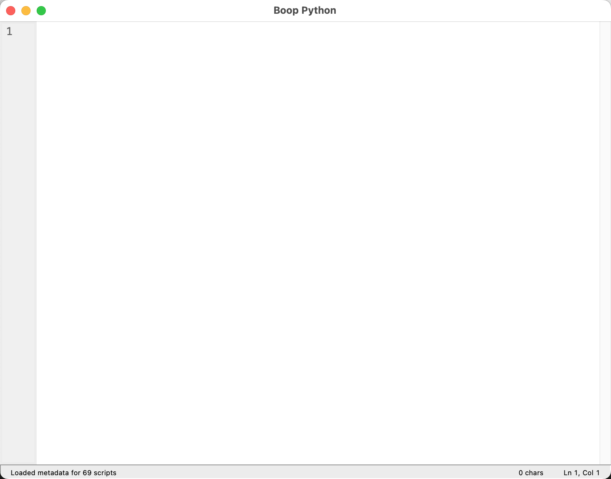
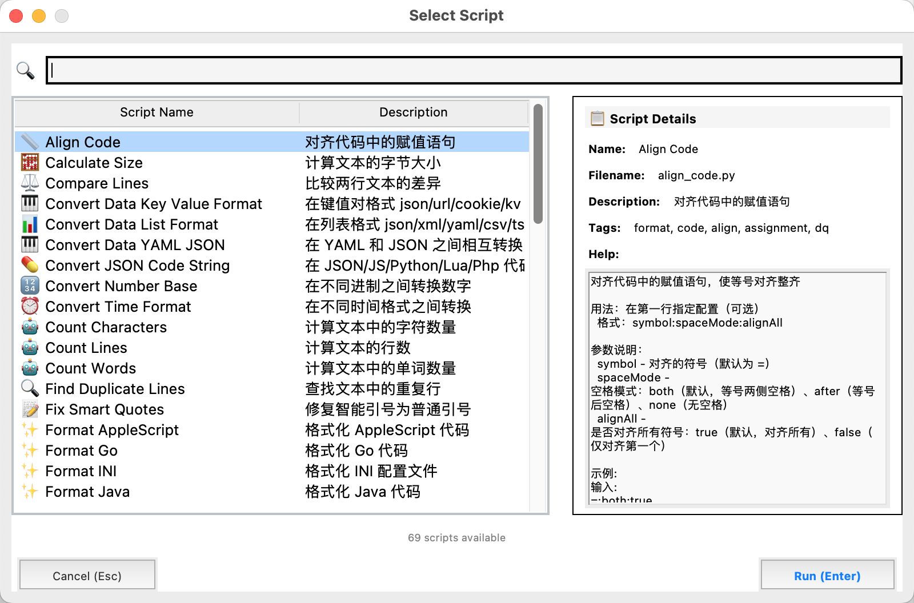
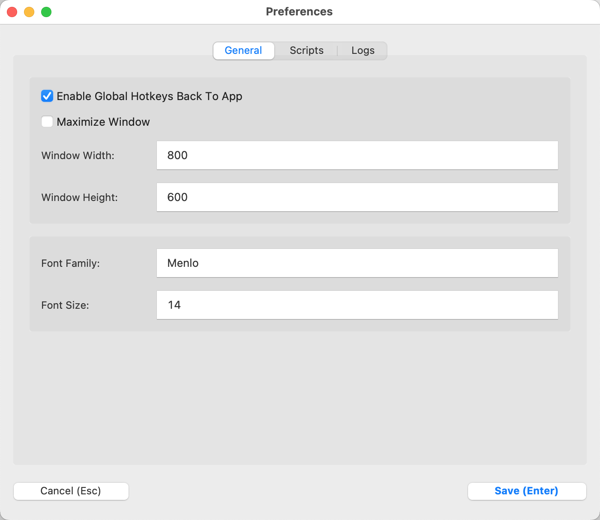
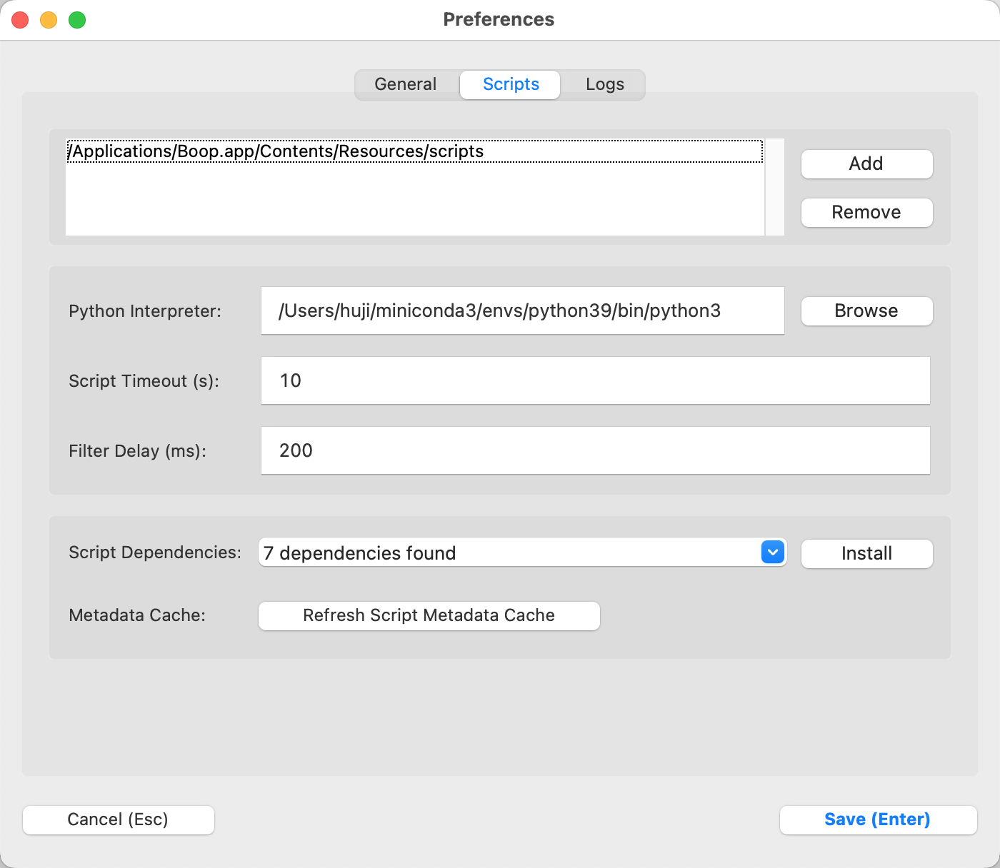
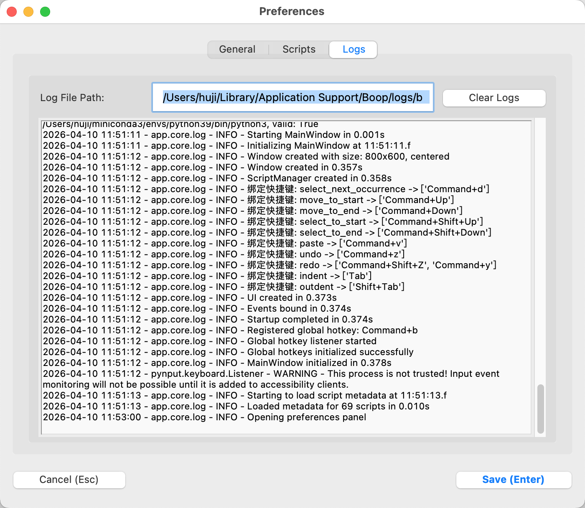

# Boop Go 技术设计文档

## 1. 项目概述

Boop 是一款跨平台的文本处理工具，核心特性包括：
- **拖拽文本处理**：用户可以将文本拖入窗口或从剪贴板获取
- **可定制的脚本片段**：用户可编写 Python 脚本对文本进行转换
- **即时反馈**：脚本执行后立即显示结果

本项目基于 Go + Gio + gvcode 构建，使用 gvcode 作为核心编辑组件，通过集成高性能的编辑器组件和脚本执行系统，实现一个轻量级、高性能的文本处理工具。

### 1.1 技术基础

本项目采用现代 Go 技术栈，具有以下核心特性：
- **高性能编辑器**：基于 gvcode 编辑器组件，支持基本文本编辑功能
- **跨平台支持**：Windows、Linux、macOS 全平台支持
- **响应式 UI**：基于 Gio 的响应式 GUI 框架
- **轻量级**：启动速度快，内存占用低
- **易于开发**：Go 语言简洁高效，开发周期短

### 1.2 开发策略

采用**全新构建**策略，具体步骤如下：

1. **项目初始化**：创建基于 Go + Gio + gvcode 的项目结构
2. **编辑器集成**：集成 gvcode 作为核心编辑组件
3. **脚本功能开发**：实现 Boop 特有的脚本处理功能
4. **UI 组件开发**：构建脚本选择器、设置窗口等 UI 组件
5. **配置系统实现**：实现配置读写和持久化
6. **性能优化**：优化启动速度和运行性能
7. **测试与发布**：进行跨平台测试和打包发布

这种策略的优势：
- **现代化技术栈**：使用最新的 Go 生态系统和 UI 框架
- **高性能**：gvcode 编辑器组件提供优异的编辑性能
- **跨平台一致性**：Gio 确保各平台体验一致
- **易于维护**：模块化设计，代码结构清晰
- **轻量简洁**：gvcode 提供基本的编辑功能，保持应用轻量

### 1.1 UI 界面原型

#### 1.1.1 主窗口（编辑器）



- **顶部菜单栏**：Boop / Edit / Script / Help
- **中央编辑区域**：文本编辑器，带行号显示
- **底部状态栏**：状态消息 | 光标位置 | 字符数

#### 1.1.2 脚本选择器



- **左侧**：脚本列表（支持搜索过滤）
- **右侧**：脚本详情（名称、描述、标签、使用帮助）
- **底部**：Cancel / Run 按钮

#### 1.1.3 首选项窗口

| General 标签 | Scripts 标签 | Logs 标签 |
|-------------|-------------|-----------|
|  |  |  |

- **General**：窗口大小、字体配置、启动选项
- **Scripts**：Python 路径、脚本目录、超时设置
- **Logs**：日志路径、日志管理

### 1.2 技术栈

| 组件 | 技术选型 | 版本 | 说明 |
|------|---------|------|------|
| 后端 | Go | 1.20+ | 高性能、跨平台、简洁高效 |
| 前端 | Gio | 0.13+ | 响应式、跨平台、Go 原生 GUI 框架 |
| 文本编辑器 | gvcode (内部集成) | 最新版 | 高性能、轻量级代码编辑器组件，已复制源码到项目内部 |
| 脚本执行 | `os/exec` | Go 标准库 | 安全、隔离、跨平台 |
| 序列化 | encoding/json | Go 标准库 | 配置管理 |
| 构建工具 | Go Build | 1.20+ | Go 官方构建工具 |

---

## 2. 架构设计

### 2.1 整体架构图

```
┌─────────────────┐     内部通信     ┌─────────────────┐     子进程     ┌─────────────────┐
│ 前端 (Gio)      │<──────────────>│ 后端 (Go)       │<──────────────>│ Python 解释器  │
│ ├── gvcode      │             │ ├── 脚本执行引擎 │                │ 执行脚本       │
│ ├── 脚本选择器  │             │ ├── 脚本管理    │                └─────────────────┘
│ └── 配置界面    │             │ └── 核心逻辑    │
└─────────────────┘             └─────────────────┘
```

### 2.2 模块职责

#### 2.2.1 前端模块 (`ui/`)

| 模块 | 职责 |
|------|------|
| `main_window.go` | 主窗口布局、菜单栏、快捷键处理、窗口生命周期 |
| `script_picker.go` | 脚本搜索、选择、执行 |
| `status_bar.go` | 状态显示、光标位置、字符数 |
| `settings.go` | 首选项窗口、配置管理界面 |
| `editor.go` | gvcode 编辑器组件集成、配置、事件处理 |

#### 2.2.2 核心功能模块 (`core/`)

| 模块 | 职责 |
|------|------|
| `script.go` | 脚本加载、元数据解析、脚本执行 |
| `config.go` | 配置结构定义、默认值、配置读写 |
| `paths.go` | 路径管理、应用目录 |
| `event.go` | 事件系统 |
| `logging.go` | 日志系统 |

#### 2.2.3 基础设施模块 (`utils/`)

| 模块 | 职责 |
|------|------|
| `persistence.go` | 文件操作、缓存管理 |
| `python_env.go` | Python 环境检测、进程管理 |
| `platform.go` | 平台特定功能 |
| `error.go` | 统一错误类型 |

#### 2.2.4 编辑器模块 (`editor/`)

| 模块 | 职责 |
|------|------|
| `editor.go` | 编辑器模块入口，集成 gvcode 核心功能 |
| `config.go` | 编辑器配置，包括字体、颜色主题等 |
| `buffer.go` | 文本缓冲区管理，基于 gvcode 的 buffer 模块 |
| `gutter.go` | 行号和侧边栏管理，基于 gvcode 的 gutter 模块 |
| `textview.go` | 文本视图渲染，基于 gvcode 的 textview 模块 |

### 2.3 模块依赖规则

| 模块 | 可依赖 |
|------|--------|
| **前端模块** | 核心功能模块、基础设施模块 |
| **核心功能模块** | 基础设施模块 |
| **基础设施模块** | 标准库和外部包（文件系统、进程等） |

---

## 3. 核心功能实现

### 3.1 输入机制

| 方式 | 实现 | 优先级 |
|------|------|--------|
| 直接编辑 | gvcode 编辑器 | P0 |
| 剪贴板粘贴 | gvcode 编辑器 (Ctrl+V) | P0 |
| 拖拽文件 | 需实现拖拽处理 | P2 |
| 剪贴板监听 | 定时轮询 | P2 |
| 缩进调整 | gvcode 编辑器 (Tab/Shift+Tab) | P1 |
| 移动到开头/结尾 | gvcode 编辑器 (Home/End, Ctrl+Home/End) | P1 |
| 选择到开头/结尾 | gvcode 编辑器 (Shift+Home/End, Ctrl+Shift+Home/End) | P1 |

### 3.2 脚本执行架构

```
UI调用execute_script → ScriptRunner → 构建State包装脚本
                                              ↓
                    返回结果给UI ← 捕获stdout/stderr ← Python子进程 ← os/exec
```

#### State API 注入

脚本执行时，Go 将以下 State 对象注入到 Python 脚本：

```python
class State:
    def __init__(self, text: str):
        self.text = text
        self._info_messages = []
        self._error_messages = []

    def insert(self, text: str, position: int = None):
        """在指定位置插入文本"""
        if position is None:
            self.text += text
        else:
            self.text = self.text[:position] + text + self.text[position:]

    def post_info(self, message: str):
        """记录信息消息"""
        self._info_messages.append(message)

    def post_error(self, message: str):
        """记录错误消息"""
        self._error_messages.append(message)
```

### 3.3 脚本元数据格式

脚本文件头部包含 JSON 元数据：

```python
#!/usr/bin/env python3
"""
{
    "name": "Upper Case",
    "desc": "Convert text to uppercase",
    "tags": ["transform", "text", "case"],
    "help": "Converts all text to uppercase letters."
}
"""
def main(state):
    state.text = state.text.upper()
```

### 3.4 配置存储

**存储位置：**

| 平台 | 路径 |
|------|------|
| macOS | `~/Library/Application Support/boop/config.json` |
| Linux | `~/.config/boop/config.json` |
| Windows | `%APPDATA%\boop\config.json` |

**配置结构：**

```go
type BoopConfig struct {
    ScriptDirectories []string            `json:"script_directories"`
    PythonPath        string              `json:"python_path"`
    FontFamily        string              `json:"font_family"`
    FontSize          int                 `json:"font_size"`
    WindowWidth       int                 `json:"window_width"`
    WindowHeight      int                 `json:"window_height"`
    MaximizeWindow    bool                `json:"maximize_window"`
    Shortcuts         map[string][]string `json:"shortcuts"`
    ScriptTimeout     int64              `json:"script_timeout"`
    FilterDelay       int64              `json:"filter_delay"`
}
```

---

## 4. 技术选型分析

### 4.1 Go GUI 框架对比

| 框架 | 优点 | 缺点 | 适用场景 |
|------|------|------|----------|
| **Gio** | 跨平台，Go 原生，性能好，API 简洁 | 生态相对年轻 | ✅ **推荐** - 现代 Go GUI 应用 |
| **Fyne** | 跨平台，Material Design 风格 | 性能相对较低 | 中大型应用 |
| **Qt for Go** | 功能丰富，成熟稳定 | 依赖 Qt，体积较大 | 复杂桌面应用 |
| **WebView** | 基于 Web 技术，开发快速 | 依赖浏览器，性能较差 | 简单工具应用 |

### 4.2 编辑器组件对比

| 组件 | 优点 | 缺点 | 推荐 |
|------|------|------|------|
| **gvcode** | 轻量级，Go 原生，基本功能完备 | 功能相对简单，无语法高亮 | ✅ **推荐** |
| **go-editor** | 功能丰富，支持语法高亮 | 外部依赖，体积较大 | 高级编辑需求 |
| **自定义实现** | 完全可控 | 开发工作量大 | 特殊需求 |

### 4.3 脚本语言选型

| 方案 | 优点 | 缺点 | 推荐 |
|------|------|------|------|
| **Python 子进程** | 兼容现有脚本，用户可 pip install | 需要 Python 环境 | ✅ **推荐** |
| Lua 嵌入 | 轻量，无外部依赖 | 需重写所有脚本 | 不推荐 |
| JavaScript (otto) | 轻量嵌入，无需外部依赖 | 功能相对有限 | 待评估 |
| WASM | 高性能，安全 | 编译复杂，用户编写门槛高 | 未来考虑 |

---

## 5. 目录结构

基于 Go + Gio + gvcode 的目录结构：

```
boop-go/
├── go.mod                        # 项目配置
├── go.sum                        # 依赖校验
├── main.go                       # 可执行入口
├── README.md                     # 项目说明
│
├── src/                          # 源代码目录
│   ├── core/                     # 核心功能模块
│   │   ├── script/               # 脚本处理
│   │   │   ├── executor.go       # 脚本执行器
│   │   │   ├── metadata.go       # 脚本元数据解析
│   │   │   └── manager.go        # 脚本管理
│   │   ├── config.go             # 配置管理
│   │   ├── paths.go              # 路径管理
│   │   ├── event.go              # 事件系统
│   │   └── logging.go            # 日志系统
│   │
│   ├── ui/                       # UI 模块
│   │   ├── main_window.go        # 主窗口
│   │   ├── script_picker.go      # 脚本选择器
│   │   ├── settings.go           # 设置窗口
│   │   └── status_bar.go         # 状态栏
│   │
│   ├── editor/                   # 编辑器模块
│   │   ├── editor.go             # 编辑器模块入口
│   │   ├── gvcode/               # gvcode 核心组件
│   │   │   ├── editor.go         # 编辑器核心实现
│   │   │   ├── textview/         # 文本视图渲染
│   │   │   ├── internal/         # 内部实现
│   │   │   │   ├── buffer/       # 文本缓冲区
│   │   │   │   ├── layout/       # 文本布局
│   │   │   │   └── painter/      # 文本绘制
│   │   │   ├── gutter/           # 行号和侧边栏
│   │   │   ├── color/            # 颜色方案
│   │   │   └── textstyle/        # 文本样式
│   │   └── config.go             # 编辑器配置
│   │
│   ├── utils/                    # 工具模块
│   │   ├── persistence.go        # 文件操作
│   │   ├── python_env.go         # Python 环境
│   │   ├── platform.go           # 平台特定功能
│   │   └── error.go              # 错误处理
│   │
│   ├── scripts/                  # Python 脚本资源
│   │   ├── __init__.py
│   │   ├── lib/
│   │   └── *.py                  # 60+ 内置脚本
│   │
│   ├── assets/                   # 静态资源
│   │   ├── fonts/                # 字体文件
│   │   └── icons/                # 图标文件
│   │
│   └── tests/                    # 测试
│       ├── integration/
│       └── unit/
│
└── design/                       # 设计文档
    ├── img/                      # UI截图
    ├── 技术设计.md
    ├── 实现与迁移.md
    ├── 构建指南.md
    ├── 目录结构.md
    └── gvcode集成方案.md        # gvcode 集成方案
```

### 5.1 目录结构说明

- **核心目录**：
  - `src/`：源代码目录，包含所有 Go 代码
  - `src/core/`：核心功能模块，包括脚本执行、配置管理等
  - `src/ui/`：UI 模块，包括主窗口、脚本选择器、设置窗口等
  - `src/editor/`：编辑器模块，封装 gvcode 编辑器组件
  - `src/editor/gvcode/`：gvcode 核心组件，包括编辑器核心实现、文本视图、缓冲区等
  - `src/utils/`：工具模块，提供通用功能
  - `src/scripts/`：Python 脚本资源
  - `src/assets/`：静态资源
  - `src/tests/`：测试目录

---

## 6. 性能优化

### 6.1 启动优化

| 优化项 | 实现方式 | 效果 |
|--------|----------|------|
| 延迟加载脚本 | 启动 1s 后异步加载 | 启动时间 < 1.5s |
| 元数据缓存 | JSON 缓存 | 避免重复解析 |
| 懒初始化 | 首次使用时初始化 | 减少内存占用 |
| 编辑器配置缓存 | 缓存编辑器配置 | 减少初始化时间 |

### 6.2 内存优化

| 优化项 | 实现方式 | 效果 |
|--------|----------|------|
| 字符串复用 | 字符串池化 | 减少内存分配 |
| 裁剪二进制 | 编译优化 -ldflags="-s -w" | 减小二进制体积 |
| 文本处理优化 | 优化文本操作算法 | 提高编辑性能 |

### 6.3 脚本执行优化

| 优化项 | 实现方式 | 效果 |
|--------|----------|------|
| Python 进程池 | 重用 Python 进程 | 减少进程启动开销 |
| 异步执行 | goroutine 异步执行 | 不阻塞 UI 线程 |
| 超时控制 | 脚本执行超时限制 | 防止无限执行 |

### 6.4 编辑器性能优化

| 优化项 | 实现方式 | 效果 |
|--------|----------|------|
| 增量渲染 | 只渲染可见部分 | 提高渲染性能 |
| 文本操作优化 | 优化文本插入、删除等操作 | 提高编辑性能 |

---

## 7. 错误处理

### 7.1 错误分类

| 错误类型 | 处理方式 | 示例 |
|----------|----------|------|
| 配置错误 | 使用默认值 + 警告日志 | Python 路径无效 |
| 脚本错误 | 弹窗显示错误信息 | 脚本执行失败 |
| 系统错误 | 记录日志 + 优雅退出 | 文件权限不足 |
| 超时 | 终止进程 + 提示用户 | 脚本执行超时 |

### 7.2 统一错误类型

```go
type BoopError struct {
    Type    string
    Message string
    Err     error
}

type ConfigError struct {
    Message string
    Err     error
}

type ScriptError struct {
    Message string
    Err     error
}

type PythonError struct {
    Message string
    Err     error
}
```

---

## 8. 测试策略

### 8.1 单元测试

- 配置序列化/反序列化
- 脚本元数据解析
- 事件系统
- 编辑器配置管理
- 编辑器事件处理

### 8.2 集成测试

- 脚本执行流程
- 配置保存/加载
- UI 交互
- 编辑器集成测试
- 脚本执行结果回填

### 8.3 编辑器功能测试

- 文本编辑功能（插入、删除、修改）
- 缩进调整（Tab/Shift+Tab）
- 移动/选择到开头/结尾（Home/End, Ctrl+Home/End）
- 大文件处理（1MB+文本）
- 行号显示
- 基本光标操作
- 文本选择功能

### 8.4 手工测试

- 跨平台测试（macOS/Windows/Linux）
- 性能基准测试
- 用户体验测试
- 编辑器功能验证
- 脚本执行测试

---

## 9. 项目特点

- **快速启动**：1-1.5 秒启动时间
- **小巧体积**：8-12 MB 二进制文件
- **现代 UI**：基于 Gio 的响应式 GUI
- **Python 脚本**：完全兼容原版 Boop 脚本
- **类型安全**：Go 编译期检查
- **跨平台**：macOS / Windows / Linux
- **轻量编辑功能**：基于 gvcode 编辑器组件，提供基本的文本编辑功能
- **高效文本处理**：优化的文本操作算法
- **易于开发**：Go 语言简洁高效，开发周期短

### 与 Python 版本对比

| 维度 | Python (Tkinter) | Go (Gio + gvcode) | 改进 |
|------|------------------|-------------------|------|
| 二进制体积 | 50-80 MB | 8-12 MB | ⬇️ 80% |
| 内存占用 | ~100 MB | ~50-100 MB | ⬇️ 0-50% |
| 启动速度 | 1-2 秒 | 1-1.5 秒 | ⬆️ 25% |
| 编辑功能 | 基础文本编辑 | 基础文本编辑 | 📍 功能相当 |
| 大文件处理 | 卡顿 | 流畅（优化的文本处理） | ⬆️ 性能优异 |

### 快捷键

| 快捷键 | 功能 |
|--------|------|
| `Cmd/Ctrl+B` | 打开脚本选择器 |
| `Cmd/Ctrl+,` | 打开首选项 |
| `Cmd/Ctrl+Q` | 退出 |
| `Cmd/Ctrl+Z` | 撤销 |
| `Cmd/Ctrl+Shift+Z` | 重做 |

---

## 10. 开发计划

### 10.1 开发策略

采用**全新构建**策略，具体步骤如下：

1. **初始化项目**：创建基于 Go + Gio 的项目结构
2. **编辑器集成**：复制 gvcode 源码到项目内部，修改导入路径，实现自定义编辑器功能
3. **脚本功能开发**：实现 Boop 特有的脚本处理功能
4. **UI 组件开发**：构建脚本选择器、设置窗口等 UI 组件
5. **配置系统实现**：实现配置读写和持久化
6. **性能优化**：优化启动速度和运行性能
7. **测试与发布**：进行跨平台测试和打包发布

### 10.2 功能实现

#### 10.2.1 核心编辑功能

| 功能 | 实现方式 | 优先级 |
|------|----------|--------|
| 文本编辑 | gvcode 编辑器 | P0 |
| 缩进调整 | gvcode 编辑器 | P1 |

#### 10.2.2 Boop 特有功能

| 功能 | 实现方式 | 优先级 |
|------|----------|--------|
| 脚本执行 | Go + Python 子进程 | P0 |
| 脚本选择器 | Gio 组件 | P0 |
| 脚本元数据解析 | Go 模块 | P0 |
| 脚本执行历史 | Go 模块 | P1 |
| 配置管理 | Go 模块 | P0 |

### 10.3 UI 组件实现

| 组件 | 实现方式 | 优先级 |
|------|----------|--------|
| 主窗口 | Gio 组件 | P0 |
| 脚本选择器 | Gio 组件 | P0 |
| 设置窗口 | Gio 组件 | P1 |
| 状态栏 | Gio 组件 | P1 |

---

## 11. 相关文档

- [实现与迁移.md](./实现与迁移.md) - 实现进度与迁移计划
- [目录结构.md](./目录结构.md) - 目录结构详细说明
- [构建指南.md](./构建指南.md) - 构建和测试脚本指南
- [gvcode集成方案.md](./gvcode集成方案.md) - gvcode 编辑器集成方案