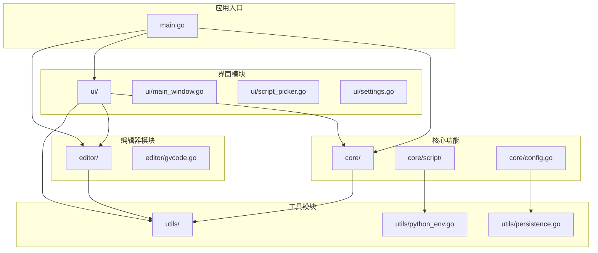

# Boop Go 目录结构设计

## 1. 设计原则

### 1.1 基于 Go + Gio + gvcode 结构

采用基于现代 Go 技术栈的目录结构，集成 Gio GUI 框架和 gvcode 编辑器组件，实现一个轻量级、高性能的文本处理工具。

### 1.2 目录结构设计思路

1. **模块化设计**：将功能划分为清晰的模块，便于维护和扩展
2. **分离关注点**：将 UI、核心功能、工具函数等分离到不同目录
3. **层次分明**：建立清晰的依赖关系，避免循环依赖
4. **易于测试**：每个模块可以独立测试
5. **简洁清晰**：使用 src 目录包装所有源代码，保持根目录简洁

---

## 2. 目录结构

```
boop-go/
├── go.mod                        # 项目配置
├── go.sum                        # 依赖校验
├── main.go                       # 可执行入口
├── README.md                     # 项目说明
│
├── src/                          # 源代码目录
│   ├── core/                     # 核心功能模块
│   │   ├── script/               # 脚本处理
│   │   │   ├── executor.go       # 脚本执行器
│   │   │   ├── metadata.go       # 脚本元数据解析
│   │   │   └── manager.go        # 脚本管理
│   │   ├── config.go             # 配置管理
│   │   ├── paths.go              # 路径管理
│   │   ├── event.go              # 事件系统
│   │   └── logging.go            # 日志系统
│   │
│   ├── ui/                       # UI 模块
│   │   ├── main_window.go        # 主窗口
│   │   ├── script_picker.go      # 脚本选择器
│   │   ├── settings.go           # 设置窗口
│   │   └── status_bar.go         # 状态栏
│   │
│   ├── editor/                   # 编辑器模块
│   │   ├── editor.go             # 编辑器模块入口
│   │   ├── gvcode/               # gvcode 核心组件
│   │   │   ├── editor.go         # 编辑器核心实现
│   │   │   ├── textview/         # 文本视图渲染
│   │   │   ├── internal/         # 内部实现
│   │   │   │   ├── buffer/       # 文本缓冲区
│   │   │   │   ├── layout/       # 文本布局
│   │   │   │   └── painter/      # 文本绘制
│   │   │   ├── gutter/           # 行号和侧边栏
│   │   │   ├── color/            # 颜色方案
│   │   │   └── textstyle/        # 文本样式
│   │   └── config.go             # 编辑器配置
│   │
│   ├── utils/                    # 工具模块
│   │   ├── persistence.go        # 文件操作
│   │   ├── python_env.go         # Python 环境
│   │   ├── platform.go           # 平台特定功能
│   │   └── error.go              # 错误处理
│   │
│   ├── scripts/                  # Python 脚本资源
│   │   ├── __init__.py
│   │   ├── lib/
│   │   └── *.py                  # 60+ 内置脚本
│   │
│   ├── assets/                   # 静态资源
│   │   ├── fonts/                # 字体文件
│   │   └── icons/                # 图标文件
│   │
│   └── tests/                    # 测试
│       ├── integration/
│       └── unit/
│
└── design/                       # 设计文档
    ├── img/                      # UI截图
    ├── 技术设计.md
    ├── 实现与迁移.md
    ├── 构建指南.md
    ├── 目录结构.md
    └── gvcode集成方案.md
```

---

## 3. 各目录职能

### 3.1 core/ - 核心功能模块
**职责**：实现应用的核心功能，包括脚本执行、配置管理、路径管理等

### 3.2 ui/ - UI 模块
**职责**：实现应用的用户界面，包括主窗口、脚本选择器、设置窗口等

### 3.3 editor/ - 编辑器模块
**职责**：封装 gvcode 编辑器组件，提供文本编辑功能

### 3.4 utils/ - 工具模块
**职责**：提供通用工具函数和辅助功能，如文件操作、Python 环境管理等

### 3.5 scripts/ - Python 脚本资源
**职责**：存储内置 Python 脚本，用于文本处理

### 3.6 assets/ - 静态资源
**职责**：存储字体、图标等静态资源

### 3.7 tests/ - 测试
**职责**：存储单元测试和集成测试

### 3.8 design/ - 设计文档
**职责**：存储设计文档和 UI 截图

---

## 4. 模块依赖关系



---

## 5. 模块详细说明

### 5.1 core/script/ - 脚本处理模块

| 文件 | 职责 |
|------|------|
| `executor.go` | 执行 Python 脚本，处理进程管理和结果获取 |
| `metadata.go` | 解析脚本元数据，处理脚本信息缓存 |
| `manager.go` | 管理脚本列表，处理脚本搜索和执行历史 |

### 5.2 ui/ - UI 模块

| 文件 | 职责 |
|------|------|
| `main_window.go` | 主窗口布局，菜单栏，快捷键处理 |
| `script_picker.go` | 脚本搜索和选择界面 |
| `settings.go` | 首选项窗口，配置管理界面 |
| `status_bar.go` | 状态栏，显示编辑状态和光标位置 |

### 5.3 editor/ - 编辑器模块

| 文件 | 职责 |
|------|------|
| `editor.go` | 编辑器模块入口，集成 gvcode 核心功能 |
| `gvcode.go` | gvcode 编辑器组件封装，提供编辑功能 |
| `buffer.go` | 文本缓冲区管理，基于 gvcode 的 buffer 模块 |
| `gutter.go` | 行号和侧边栏管理，基于 gvcode 的 gutter 模块 |
| `textview.go` | 文本视图渲染，基于 gvcode 的 textview 模块 |
| `config.go` | 编辑器配置管理 |

### 5.4 utils/ - 工具模块

| 文件 | 职责 |
|------|------|
| `persistence.go` | 文件读写，配置持久化 |
| `python_env.go` | Python 环境检测，进程管理 |
| `platform.go` | 平台特定功能，路径处理 |
| `error.go` | 统一错误类型定义 |

---

## 6. 与 Python 版本目录结构对比

| 目录 | Python 版 | Go 版 | 说明 |
|------|----------|-------|------|
| `src/core/` | ❌ | ✅ | 新增，核心功能模块 |
| `src/ui/` | ❌ | ✅ | 新增，UI 模块 |
| `src/editor/` | ❌ | ✅ | 新增，编辑器模块 |
| `src/utils/` | ❌ | ✅ | 新增，工具模块 |
| `src/scripts/` | ✅ | ✅ | 保留，Python 脚本资源 |
| `src/assets/` | ❌ | ✅ | 新增，静态资源 |
| `src/tests/` | ❌ | ✅ | 新增，测试目录 |
| `design/` | ❌ | ✅ | 新增，设计文档 |

---

## 7. 最佳实践

1. **模块划分**：按照功能职责划分模块，保持模块的单一职责
2. **依赖管理**：遵循从上层到底层的依赖方向，避免循环依赖
3. **代码组织**：每个模块内部按照功能进一步划分为多个文件
4. **测试覆盖**：为每个模块编写单元测试，确保功能正确性
5. **文档完善**：为每个模块和重要函数编写文档注释

---

## 8. 扩展性考虑

1. **插件系统**：预留插件接口，支持未来扩展
2. **主题系统**：支持自定义主题，提供主题配置接口
3. **脚本系统**：支持用户自定义脚本，扩展文本处理能力

---

## 9. 总结

本目录结构设计基于现代 Go 项目的最佳实践，采用模块化、层次化的设计理念，确保代码的可维护性和可扩展性。通过使用 src 目录包装所有源代码，保持了根目录的简洁清晰，使得项目结构更加专业和易于管理。同时，预留了扩展接口，为未来功能的添加和优化提供了灵活性。