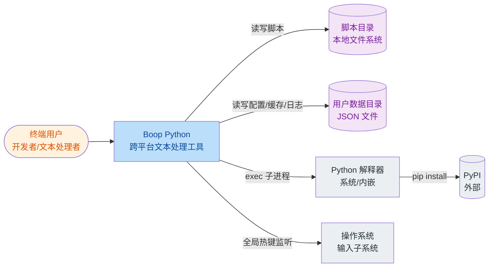

# C4 Level 1 — 系统上下文

> 受众：业务与技术干系人。范围：外部参与者与相邻系统。

## 系统上下文图

## 外部参与者与系统

| 类型 | 名称 | 说明 | 证据 |
|------|------|------|------|
| 人类参与者 | 终端用户 | 在编辑器中输入文本、触发脚本、配置偏好 | [USER_GUIDE.md](file:///Users/huji/work/MyProject/code_mine/gitee/boop/boop/USER_GUIDE.md) |
| 上游系统 | Python 解释器 | 执行用户脚本的运行时；可由用户在偏好设置中指定路径，或使用 PyInstaller 内嵌环境 | [app/core/utils.py#L24-L49](file:///Users/huji/work/MyProject/code_mine/gitee/boop/boop/app/core/utils.py#L24-L49) |
| 上游系统 | PyPI | 脚本声明的第三方依赖安装来源 | [app/ui/preferences.py](file:///Users/huji/work/MyProject/code_mine/gitee/boop/boop/app/ui/preferences.py)（Scripts Tab 安装依赖） |
| 上游系统 | 操作系统输入子系统 | `pynput` 监听全局键盘事件的来源 | [app/core/global_hotkey.py#L6](file:///Users/huji/work/MyProject/code_mine/gitee/boop/boop/app/core/global_hotkey.py#L6) |
| 数据存储 | 脚本目录（本地 FS） | 默认 `<project>/scripts/`，可配置多目录 | [app/core/path.py#get_default_script_dir](file:///Users/huji/work/MyProject/code_mine/gitee/boop/boop/app/core/path.py#L52-L76) |
| 数据存储 | 用户数据目录（本地 FS） | 配置 `config.json`、缓存 `cache/metadata.json`、日志 `logs/boop.log` | [app/core/path.py#get_user_data_dir](file:///Users/huji/work/MyProject/code_mine/gitee/boop/boop/app/core/path.py#L8-L35) |

## 部署上下文

- **桌面应用**：单机运行，无服务端组件。
- **打包形态**：PyInstaller `--onedir --windowed`，产出 macOS `.app`、Linux 可执行目录、Windows 可执行目录（证据：[build.sh#L116-L158](file:///Users/huji/work/MyProject/code_mine/gitee/boop/boop/build.sh#L116-L158)）。
- **分发产物**：macOS DMG、Linux tar.gz、Windows zip（证据：[build.sh#create_dmg/create_tarball/create_zip](file:///Users/huji/work/MyProject/code_mine/gitee/boop/boop/build.sh#L160-L185)）。
