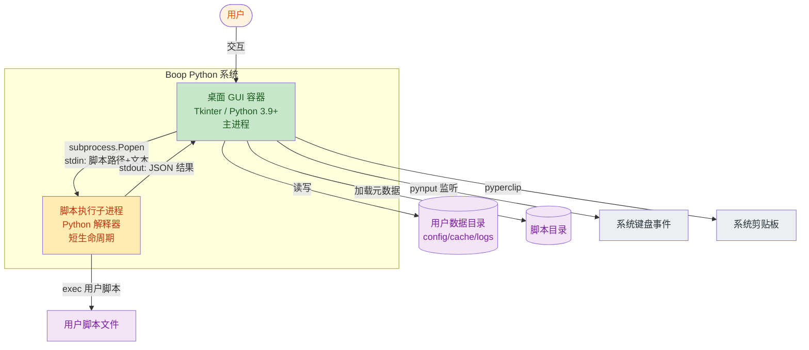

# C4 Level 2 — 容器

> 受众：开发者与运维。一个容器 = 一个独立部署/运行的单元。

## 容器图

Boop Python 是一个**单体桌面应用**，运行时只有一个主进程。但运行期会派生短暂的**子进程**用于隔离执行用户脚本。因此划分为两个逻辑容器：



## 容器清单

### C-1. 桌面 GUI 容器（主进程）

| 属性 | 值 |
|------|-----|
| 类型 | 桌面 GUI 应用（单进程，主线程跑 Tk 事件循环） |
| 技术 | Python 3.9+ / Tkinter（stdlib）/ ttk |
| 关键依赖 | `pynput`（全局热键）、`pyperclip`（剪贴板）、`Pillow`（仅构建期图标处理） |
| 入口 | `app/__main__.py` → `python -m app` |
| 职责 | UI 渲染、编辑器、脚本选择器、偏好设置、配置持久化、元数据缓存、日志、快捷键、派生子进程 |
| 入站接口 | Tk 事件（键盘/鼠标）、`pynput` 全局键盘事件 |
| 出站接口 | 文件 I/O（config/cache/logs/scripts）、`subprocess.Popen`、`pyperclip` |
| 数据存储 | 用户数据目录（JSON 文件）+ 脚本目录 |
| 并发模型 | 单主线程 + 1 个 daemon 线程（全局热键监听，证据：[app/core/global_hotkey.py#L58-L60](file:///Users/huji/work/MyProject/code_mine/gitee/boop/boop/app/core/global_hotkey.py#L58-L60)） |
| 部署形态 | PyInstaller `--onedir --windowed` |

### C-2. 脚本执行子进程（短生命周期）

| 属性 | 值 |
|------|-----|
| 类型 | 短命子进程，每次执行脚本时派生 |
| 技术 | Python 解释器（用户配置路径 / PyInstaller 内嵌 / sys.executable） |
| 入口 | `app/core/script_wrapper.py`（被主进程作为子进程启动） |
| 入站接口 | `stdin`：第一行为脚本路径，剩余为输入文本 |
| 出站接口 | `stdout`：JSON `{success, output, error}`；`stderr`：`INFO:` / `ERROR:` 日志 |
| 职责 | 在隔离进程中 `exec` 用户脚本，捕获异常，回传结果 |
| 超时 | 由配置 `script_timeout` 控制（默认 10s，证据：[app/config/settings.py#L74](file:///Users/huji/work/MyProject/code_mine/gitee/boop/boop/app/config/settings.py#L74)） |
| 隔离机制 | 独立进程，崩溃不影响主进程；通过 `sys.path.insert` 加载脚本所在目录 |

## 容器间通信契约

主进程 → 子进程：通过 `subprocess.Popen` + `stdin` 文本管道。

```
<script_path>\n<input_text>
```

子进程 → 主进程：通过 `stdout` JSON 文本。

```json
{
  "success": true,
  "output": "<处理后的文本>",
  "error": "",
  "stderr": "<子进程 stderr 内容>"
}
```

证据：[app/core/utils.py#L62-L86](file:///Users/huji/work/MyProject/code_mine/gitee/boop/boop/app/core/utils.py#L62-L86)、[app/core/script_wrapper.py](file:///Users/huji/work/MyProject/code_mine/gitee/boop/boop/app/core/script_wrapper.py)。

## 不存在的容器

明确指出**未实现**的容器（避免误判）：

- 无 Web 服务容器（无 WSGI/ASGI）
- 无后台 worker / 任务队列（无 Celery/RQ/Dramatiq）
- 无数据库服务（仅 JSON 文件）
- 无缓存服务（仅本地 JSON 文件缓存）
