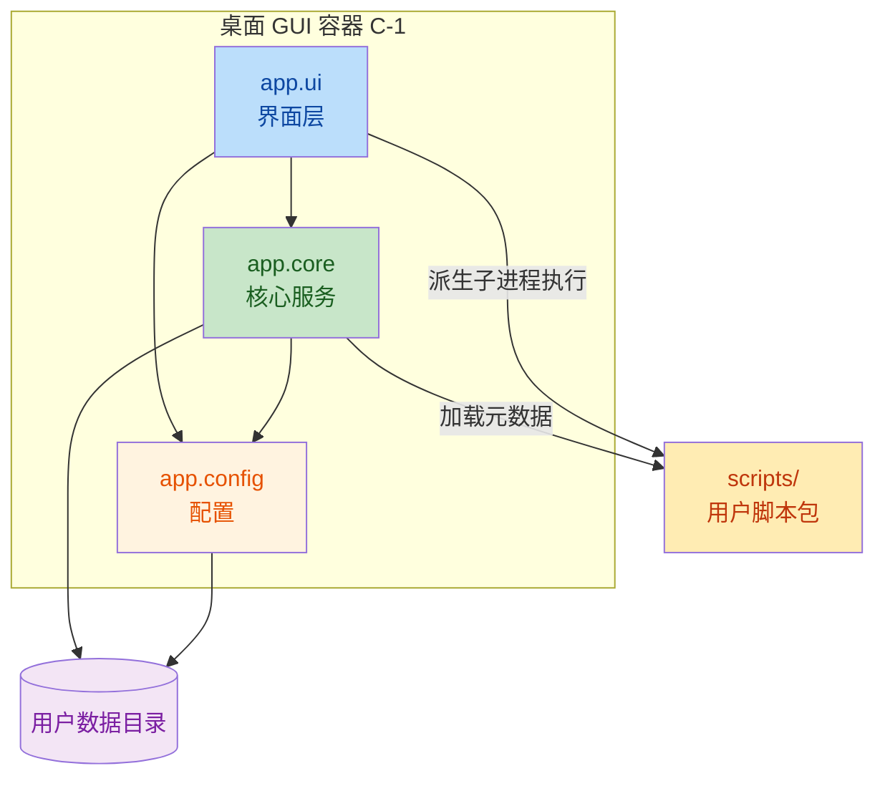

# C4 Level 3 — 组件

> 受众：开发者。对 C-1 桌面 GUI 容器做包级分解。子进程容器 C-2 仅含 `script_wrapper.py` 单文件，不再展开。

## 组件图

## 组件清单

### app.ui — 界面层

| 模块 | 职责 | 关键导出 | 证据 |
|------|------|----------|------|
| `app/ui/main.py` | 主窗口、菜单、状态栏、协调脚本选择与执行 | `MainWindow` | [main.py](file:///Users/huji/work/MyProject/code_mine/gitee/boop/boop/app/ui/main.py) |
| `app/ui/editor.py` | 文本编辑器组件，支持撤销/重做、多光标、缩进、行号 | `Editor` | [editor.py](file:///Users/huji/work/MyProject/code_mine/gitee/boop/boop/app/ui/editor.py) |
| `app/ui/editor_extensions.py` | 编辑器扩展（多光标编辑、选区管理） | `EditorExtensions` | [editor_extensions.py](file:///Users/huji/work/MyProject/code_mine/gitee/boop/boop/app/ui/editor_extensions.py) |
| `app/ui/script_picker.py` | 脚本模糊搜索选择弹窗 | `ScriptPickerPopup` | [script_picker.py](file:///Users/huji/work/MyProject/code_mine/gitee/boop/boop/app/ui/script_picker.py) |
| `app/ui/preferences.py` | 偏好设置面板（General / Scripts / Logs） | `PreferencesPanel` | [preferences.py](file:///Users/huji/work/MyProject/code_mine/gitee/boop/boop/app/ui/preferences.py) |

### app.core — 核心服务

| 模块 | 职责 | 关键导出 | 证据 |
|------|------|----------|------|
| `app/core/script.py` | 脚本管理器，加载多目录脚本元数据 | `ScriptManager` | [script.py](file:///Users/huji/work/MyProject/code_mine/gitee/boop/boop/app/core/script.py) |
| `app/core/script_metadata.py` | 从脚本 docstring 解析 JSON 元数据 | `ScriptMetadata` | [script_metadata.py](file:///Users/huji/work/MyProject/code_mine/gitee/boop/boop/app/core/script_metadata.py) |
| `app/core/cache.py` | 元数据磁盘缓存，按 mtime 失效 | `MetadataCache` | [cache.py](file:///Users/huji/work/MyProject/code_mine/gitee/boop/boop/app/core/cache.py) |
| `app/core/utils.py` | 子进程脚本执行 + 窗口居中 + **重复的快捷键工具函数** | `run_script_in_subprocess`, `center_window` | [utils.py](file:///Users/huji/work/MyProject/code_mine/gitee/boop/boop/app/core/utils.py) |
| `app/core/shortcut_manager.py` | 统一快捷键解析与绑定（Tk + pynput） | `shortcut_manager`, `ShortcutManager` | [shortcut_manager.py](file:///Users/huji/work/MyProject/code_mine/gitee/boop/boop/app/core/shortcut_manager.py) |
| `app/core/global_hotkey.py` | 系统级全局热键监听（独立线程） | `global_hotkey_manager` | [global_hotkey.py](file:///Users/huji/work/MyProject/code_mine/gitee/boop/boop/app/core/global_hotkey.py) |
| `app/core/event.py` | 进程内发布订阅事件总线 | `event_system`, `EventSystem` | [event.py](file:///Users/huji/work/MyProject/code_mine/gitee/boop/boop/app/core/event.py) |
| `app/core/log.py` | 日志配置：RotatingFileHandler 5MB×3 | `logger` | [log.py](file:///Users/huji/work/MyProject/code_mine/gitee/boop/boop/app/core/log.py) |
| `app/core/path.py` | 路径解析：用户数据目录、日志目录、默认脚本目录（兼容 PyInstaller `_MEIPASS`） | `get_user_data_dir`, `get_log_path`, `get_default_script_dir` | [path.py](file:///Users/huji/work/MyProject/code_mine/gitee/boop/boop/app/core/path.py) |
| `app/core/script_wrapper.py` | **子进程入口脚本**，读 stdin、exec 用户脚本、写 JSON 到 stdout | （脚本本身） | [script_wrapper.py](file:///Users/huji/work/MyProject/code_mine/gitee/boop/boop/app/core/script_wrapper.py) |

### app.config — 配置

| 模块 | 职责 | 关键导出 | 证据 |
|------|------|----------|------|
| `app/config/settings.py` | 应用配置数据类 + JSON 加载/保存 + 平台默认快捷键 | `BoopConfig` | [settings.py](file:///Users/huji/work/MyProject/code_mine/gitee/boop/boop/app/config/settings.py) |

### scripts/ — 用户脚本包

| 模块 | 职责 | 证据 |
|------|------|------|
| `scripts/lib/base.py` | 脚本运行时基类 `State`（提供 `post_info`/`post_error`） | [base.py](file:///Users/huji/work/MyProject/code_mine/gitee/boop/boop/scripts/lib/base.py) |
| `scripts/format_*.py` 等 60+ 脚本 | 各类文本处理（格式化、转换、统计、编解码、行操作、大小写） | [scripts/](file:///Users/huji/work/MyProject/code_mine/gitee/boop/boop/scripts) 目录 |

## 公共 API 表面

顶层包的 `__init__.py` 导出：

| 包 | 导出 | 证据 |
|----|------|------|
| `app` | `__version__`, `__author__`（无功能符号重导出） | [app/__init__.py](file:///Users/huji/work/MyProject/code_mine/gitee/boop/boop/app/__init__.py) |
| `app.config` | `BoopConfig` | [app/config/__init__.py](file:///Users/huji/work/MyProject/code_mine/gitee/boop/boop/app/config/__init__.py) |
| `app.core` | `ScriptMetadata` | [app/core/__init__.py](file:///Users/huji/work/MyProject/code_mine/gitee/boop/boop/app/core/__init__.py) |
| `app.ui` | `MainWindow`, `ScriptPickerPopup`, `PreferencesPanel` | [app/ui/__init__.py](file:///Users/huji/work/MyProject/code_mine/gitee/boop/boop/app/ui/__init__.py) |
| `scripts` | （无 `__all__`，按文件名独立加载） | [scripts/__init__.py](file:///Users/huji/work/MyProject/code_mine/gitee/boop/boop/scripts/__init__.py) |

## 全局单例

代码中存在多个模块级全局单例，通过 `from <module> import <instance>` 共享：

| 单例 | 模块 | 用途 |
|------|------|------|
| `logger` | `app.core.log` | 全局日志器 |
| `shortcut_manager` | `app.core.shortcut_manager` | 快捷键解析绑定 |
| `global_hotkey_manager` | `app.core.global_hotkey` | 全局热键监听 |
| `event_system` | `app.core.event` | 进程内事件总线 |

> ⚠️ 单例在模块导入时即初始化（如 `logger = setup_logging()` 立即创建文件 handler），不利于测试与多实例隔离。详见 [Python 工程特性分析](./07-python-specifics.md)。
