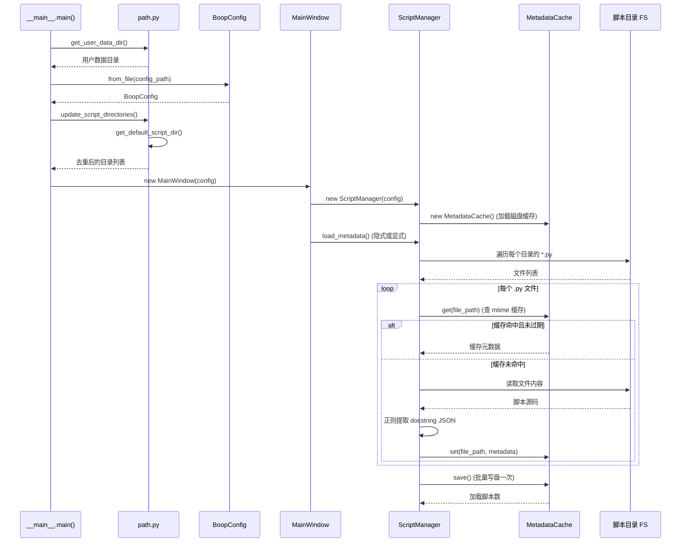
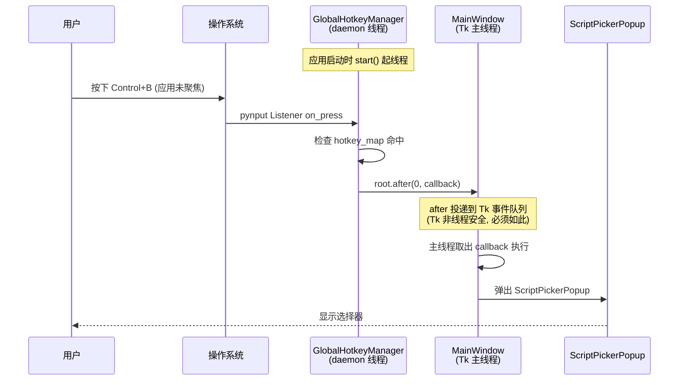
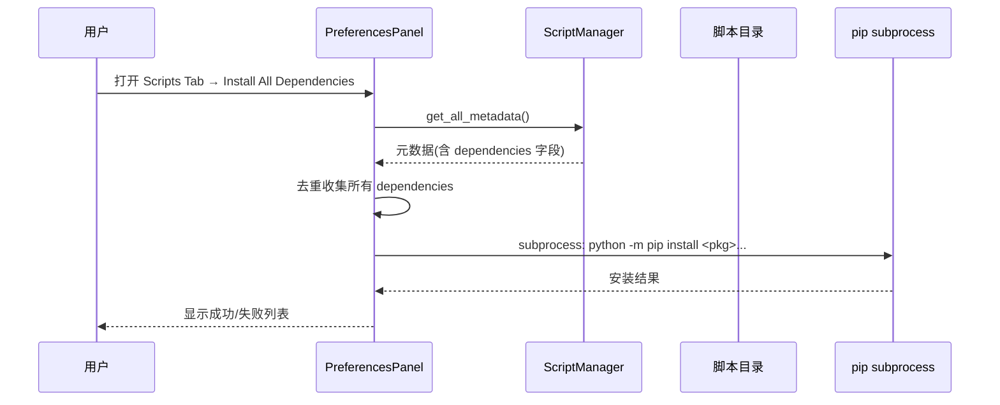

# Boop Python — 数据流

> 选 4 个代表性用户旅程。所有流程为同步（除全局热键监听线程）。

## Journey 1: 用户执行脚本格式化文本

### 参与者
- 用户
- MainWindow（主进程 UI 线程）
- ScriptManager（元数据查询）
- subprocess（脚本执行子进程 C-2）
- 用户脚本 + script_wrapper

### 序列图

```mermaid
sequenceDiagram
    participant U as 用户
    participant MW as MainWindow
    participant SP as ScriptPickerPopup
    participant SM as ScriptManager
    participant SU as subprocess.Popen
    participant SW as script_wrapper.py
    participant US as 用户脚本 main()

    U->>MW: Cmd+B / Ctrl+B
    MW->>SP: 弹出选择器
    SP->>SM: get_all_metadata()
    SM-->>SP: 元数据字典
    SP-->>U: 渲染可搜索列表
    U->>SP: 输入过滤词 + Enter
    SP->>MW: 选中脚本元数据
    MW->>MW: 取编辑器选中文本
    MW->>SU: Popen([python, wrapper], stdin=路径+文本)
    SU->>SW: 启动子进程
    SW->>SW: 读 stdin 第一行=脚本路径
    SW->>SW: 读 stdin 剩余=输入文本
    SW->>SW: exec(脚本代码)
    SW->>US: state=ScriptExecution(text); main(state)
    US-->>SW: 修改 state.text
    SW-->>SU: stdout={success, output, error}
    SU-->>MW: stdout+stderr
    MW->>MW: 解析 JSON, 替换编辑器选区
    MW-->>U: 显示处理后文本
```

### 标注
- **同步/异步边界**：全部同步。`process.communicate(timeout=script_timeout)` 阻塞主线程——UI 在脚本执行期间冻结（默认超时 10s）。
- **事务边界**：无。脚本失败时返回原文本（[utils.py#L80-L84](file:///Users/huji/work/MyProject/code_mine/gitee/boop/boop/app/core/utils.py#L80-L84)），编辑器不修改。
- **重试/回退**：无重试。JSON 解析失败时返回失败结果对象。
- **缓存**：脚本元数据走 `MetadataCache`（按 mtime 失效），脚本**执行结果不缓存**。

---

## Journey 2: 应用启动加载脚本元数据

### 序列图



### 标注
- **性能优化**：[script.py#L69-L71](file:///Users/huji/work/MyProject/code_mine/gitee/boop/boop/app/core/script.py#L69-L71) 批量写盘一次，避免每个文件一次 I/O。
- **失效策略**：`mtime >= file_mtime` 视为有效（[cache.py#L78](file:///Users/huji/work/MyProject/code_mine/gitee/boop/boop/app/core/cache.py#L78)），同秒内编辑可能误判。

---

## Journey 3: 全局热键唤起应用

### 序列图



### 标注
- **线程安全**：[global_hotkey.py#L89-L92](file:///Users/huji/work/MyProject/code_mine/gitee/boop/boop/app/core/global_hotkey.py#L89-L92) 正确使用 `root.after(0, callback)` 跨线程调度，避免直接在监听线程操作 Tk。
- **开关**：`config.enable_global_hotkeys` 控制是否启用（[settings.py#L76](file:///Users/huji/work/MyProject/code_mine/gitee/boop/boop/app/config/settings.py#L76)）。

---

## Journey 4: 安装脚本依赖

### 序列图



### 标注
- **依赖来源**：脚本在 docstring JSON 中声明 `dependencies: ["json5", "yaml"]`（见 [format_json.py#L8](file:///Users/huji/work/MyProject/code_mine/gitee/boop/boop/scripts/format_json.py#L8)）。
- **风险**：依赖直接 pip 安装到当前 Python 环境（无虚拟环境隔离），可能与主应用依赖冲突。

---

## 横切观察

- **关键路径**：Journey 1 是用户感知性能的核心——`process.communicate` 阻塞主线程，长脚本会导致 UI 卡顿。
- **失败模式**：脚本抛异常 → 子进程捕获 → 返回 `success=false` → 编辑器保持原文本（用户感知为"没生效"），错误信息仅在 stderr/日志。建议在 UI 给出可见提示。
- **可观测性缺口**：Journey 1 的子进程 stderr 仅写入主进程日志，未在 UI 呈现给用户；脚本作者的 `post_info`/`post_error` 输出走 stderr 但被主进程当作字符串接收（[script_wrapper.py#L28-L31](file:///Users/huji/work/MyProject/code_mine/gitee/boop/boop/app/core/script_wrapper.py#L28-L31)），未结构化解析。
