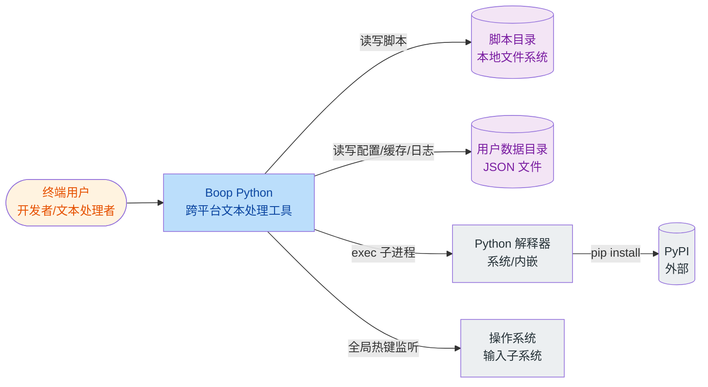
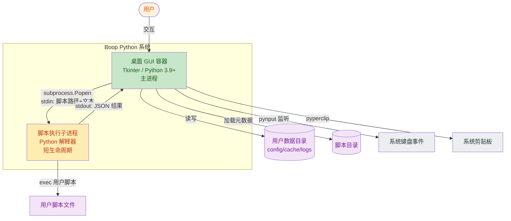
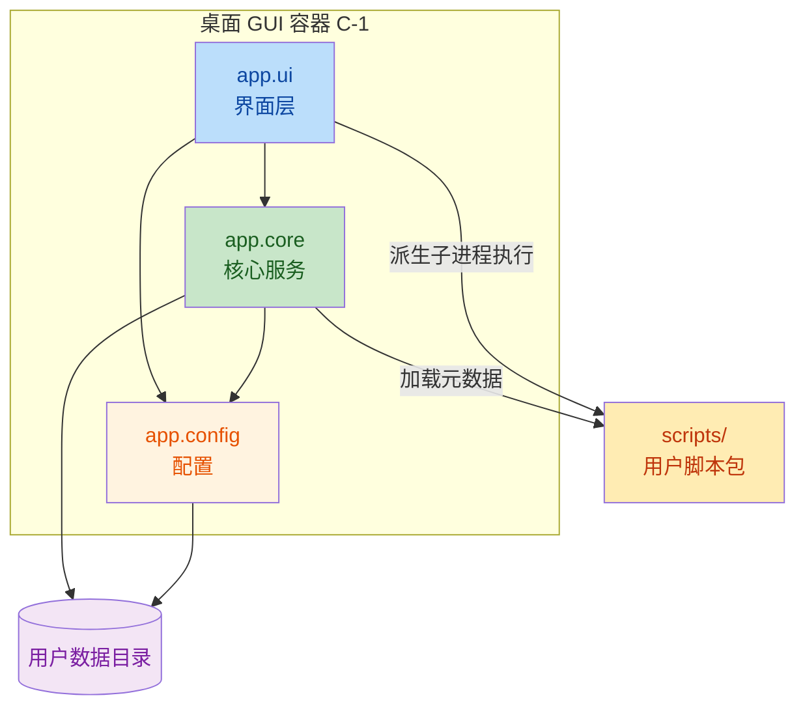
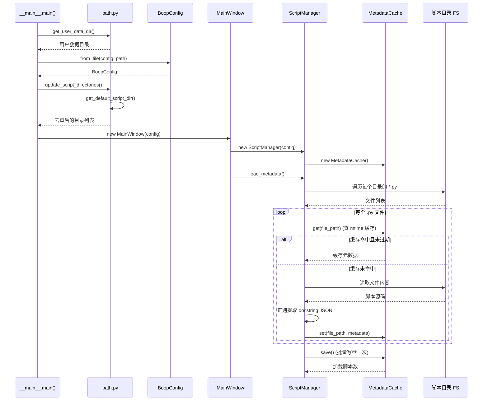
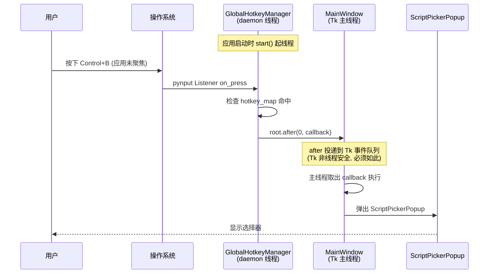
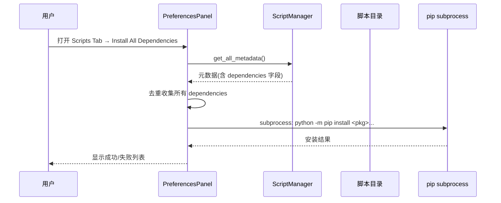

# Boop Python — 架构与开发文档

> 基于代码勘察生成，所有结论附带文件证据。

## 快速结论

**架构风格**：单体 Tkinter 桌面应用 + 子进程隔离脚本执行。同步模型，单主线程 + 1 daemon 线程（全局热键）。

**Top 3 优势**
1. **进程级脚本隔离**——用户脚本崩溃不影响主应用（[ADR-0001](./decisions/0001-use-subprocess-isolation-for-scripts.md)）
2. **精细的 PyInstaller 裁剪**——`EXCLUDE_MODULES` 列表把体积控制在 ~30-40MB
3. **充分日志埋点**——`__main__.py` 与 `MainWindow` 各阶段耗时记录

**Top 3 风险**
1. **无 `pyproject.toml`**——非可安装包，依赖与构建元数据无单一来源（见 §7.1）
2. **分层违规**——`core` ↔ `config` 双向依赖；`shortcut_manager` 在 core 却依赖 tkinter（见 §3）
3. **功能重复**——`utils.py` 与 `shortcut_manager.py` 四个快捷键函数完全重复（见 §4）

**阅读路径**：产品概览 → C4 架构图 → 数据流 → 模块依赖 → 工程特性 → 已知问题

---

## 1. 产品定位

Boop Python 是一个**跨平台桌面文本处理工具**，灵感来自 macOS 原生应用 [Boop](https://github.com/IvanMathy/Boop)。用户在编辑器中输入或粘贴文本，通过快捷键唤起脚本选择器，执行 Python 脚本对选中文本进行格式化、转换、统计、编解码等处理。

与原 Boop 的关键差异：

| 特性 | 原 Boop | Boop Python |
|------|---------|-------------|
| 脚本语言 | JavaScript | Python |
| 执行方式 | JavaScriptCore（进程内） | 子进程隔离 |
| UI | 原生 macOS (Swift) | Tkinter（跨平台） |
| 配置 | macOS Preferences | JSON 文件 |
| 平台 | 仅 macOS | macOS / Linux / Windows |

## 2. 业务目标与成功指标

| 目标 | 指标 | 目标值 | 数据来源 |
|------|------|--------|----------|
| 跨平台一致体验 | 支持平台数 | 3（macOS/Linux/Windows） | [run_tools.sh](../run_tools.sh) |
| 脚本丰富度 | 内置脚本数 | 70+ | [scripts/](../scripts/) 目录 |
| 启动响应快 | 主窗口初始化耗时 | < 1s | [app/__main__.py](../app/__main__.py) 已埋点 |
| 脚本执行安全 | 崩溃不影响主进程 | 100%（子进程隔离） | [app/core/utils.py](../app/core/utils.py) |
| 分发包体积适中 | 安装包大小 | < 50 MB | PyInstaller `--onedir` + UPX 压缩 |

## 3. 干系人与用户画像

| 画像 | 角色 | 目标 | 痛点 |
|------|------|------|------|
| 开发者 | 写代码的工程师 | 快速对文本做格式化/转换，不打断编码流 | IDE 内置工具能力有限，切换浏览器工具成本高 |
| 脚本作者 | 扩展工具的用户 | 用 Python 编写自定义文本处理脚本 | 需要简单可测的脚本契约与依赖安装机制 |
| 运维者 | 打包分发的人 | 一键产出三平台安装包 | 跨平台依赖与图标处理繁琐 |

## 4. 业务能力（顶层）

- **CAP-1 文本编辑** — Tkinter 编辑器，支持撤销/重做、多光标、缩进、剪贴板（[app/ui/editor.py](../app/ui/editor.py)）
- **CAP-2 脚本执行** — 子进程隔离执行用户脚本，超时控制，结果回传（[app/core/utils.py#run_script_in_subprocess](../app/core/utils.py)）
- **CAP-3 脚本管理** — 多目录加载、元数据解析（docstring 内 JSON）、缓存（[app/core/script.py](../app/core/script.py)）
- **CAP-4 脚本发现** — 模糊搜索选择器，按名称/描述/标签匹配（[app/ui/script_picker.py](../app/ui/script_picker.py)）
- **CAP-5 快捷键** — 应用内绑定 + 系统级全局热键（[app/core/shortcut_manager.py](../app/core/shortcut_manager.py)、[app/core/global_hotkey.py](../app/core/global_hotkey.py)）
- **CAP-6 配置管理** — JSON 持久化配置，含字体/窗口/脚本目录/Python 路径（[app/config/settings.py](../app/config/settings.py)）
- **CAP-7 偏好设置** — 多 Tab GUI：General / Scripts / Logs（[app/ui/preferences.py](../app/ui/preferences.py)）
- **CAP-8 依赖安装** — 解析脚本声明的依赖并 pip 安装（[app/ui/preferences.py](../app/ui/preferences.py) Scripts Tab）
- **CAP-9 可观测性** — 滚动日志文件（5MB×3）+ stdout（[app/core/log.py](../app/core/log.py)）
- **CAP-10 事件通信** — 进程内发布订阅解耦组件（[app/core/event.py](../app/core/event.py)）

## 5. 领域术语表（Ubiquitous Language）

| 术语 | 定义 | 同义词 |
|------|------|--------|
| Script | 用户编写的 Python 文本处理单元，须定义 `main(state)` | 脚本 |
| State | 脚本执行上下文，承载输入文本与输出，提供 `post_info`/`post_error` | state |
| ScriptMetadata | 从脚本 docstring 解析的 JSON 元数据（名称/描述/标签/依赖/图标） | 元数据 |
| ScriptPicker | 模糊搜索脚本的选择器弹窗 | 脚本选择器 |
| Preferences | 偏好设置面板 | 首选项 |
| GlobalHotkey | 系统级热键，应用未聚焦时也能触发 | 全局快捷键 |
| MetadataCache | 脚本元数据磁盘缓存，按文件 mtime 失效 | 缓存 |
| script_wrapper | 子进程入口脚本，读 stdin、exec 用户脚本、写 JSON 到 stdout | 脚本包装器 |

## 6. 范围边界

**范围内：**
- 桌面 GUI 文本处理（Tkinter）
- 用户自定义 Python 脚本的加载、执行、缓存
- 跨平台打包分发（DMG / tar.gz / zip）
- 应用内与系统级快捷键

**范围外：**
- 服务端 / Web API / 多用户协作
- 数据库持久化（仅 JSON 文件配置与缓存）
- 自动更新机制（未实现，需手动分发新版本）
- 移动端
- 网络 Accounts / 云同步

---

## 7. C4 架构图

### 7.1 L1 — 系统上下文

> 受众：业务与技术干系人。范围：外部参与者与相邻系统。



**外部参与者与系统：**

| 类型 | 名称 | 说明 | 证据 |
|------|------|------|------|
| 人类参与者 | 终端用户 | 在编辑器中输入文本、触发脚本、配置偏好 | [README.md](../README.md) |
| 上游系统 | Python 解释器 | 执行用户脚本的运行时；可由用户在偏好设置中指定路径，或使用 PyInstaller 内嵌环境 | [app/core/utils.py](../app/core/utils.py) |
| 上游系统 | PyPI | 脚本声明的第三方依赖安装来源 | [app/ui/preferences.py](../app/ui/preferences.py) |
| 上游系统 | 操作系统输入子系统 | `pynput` 监听全局键盘事件的来源 | [app/core/global_hotkey.py](../app/core/global_hotkey.py) |
| 数据存储 | 脚本目录（本地 FS） | 默认 `<project>/scripts/`，可配置多目录 | [app/core/path.py](../app/core/path.py) |
| 数据存储 | 用户数据目录（本地 FS） | 配置 `config.json`、缓存 `cache/metadata.json`、日志 `logs/boop.log` | [app/core/path.py](../app/core/path.py) |

**部署上下文：**
- **桌面应用**：单机运行，无服务端组件。
- **打包形态**：PyInstaller `--onedir --windowed`，产出 macOS `.app`、Linux 可执行目录、Windows 可执行目录。
- **分发产物**：macOS DMG、Linux tar.gz、Windows zip。

### 7.2 L2 — 容器

> 受众：开发者与运维。一个容器 = 一个独立部署/运行的单元。

Boop Python 是一个**单体桌面应用**，运行时只有一个主进程。但运行期会派生短暂的**子进程**用于隔离执行用户脚本。因此划分为两个逻辑容器：



**容器清单：**

#### C-1. 桌面 GUI 容器（主进程）

| 属性 | 值 |
|------|-----|
| 类型 | 桌面 GUI 应用（单进程，主线程跑 Tk 事件循环） |
| 技术 | Python 3.9+ / Tkinter（stdlib）/ ttk |
| 关键依赖 | `pynput`（全局热键）、`pyperclip`（剪贴板）、`Pillow`（仅构建期图标处理） |
| 入口 | `app/__main__.py` → `python -m app` |
| 职责 | UI 渲染、编辑器、脚本选择器、偏好设置、配置持久化、元数据缓存、日志、快捷键、派生子进程 |
| 入站接口 | Tk 事件（键盘/鼠标）、`pynput` 全局键盘事件 |
| 出站接口 | 文件 I/O（config/cache/logs/scripts）、`subprocess.Popen`、`pyperclip` |
| 数据存储 | 用户数据目录（JSON 文件）+ 脚本目录 |
| 并发模型 | 单主线程 + 1 个 daemon 线程（全局热键监听） |
| 部署形态 | PyInstaller `--onedir --windowed` |

#### C-2. 脚本执行子进程（短生命周期）

| 属性 | 值 |
|------|-----|
| 类型 | 短命子进程，每次执行脚本时派生 |
| 技术 | Python 解释器（用户配置路径 / PyInstaller 内嵌 / sys.executable） |
| 入口 | `app/core/script_wrapper.py`（被主进程作为子进程启动） |
| 入站接口 | `stdin`：第一行为脚本路径，剩余为输入文本 |
| 出站接口 | `stdout`：JSON `{success, output, error}`；`stderr`：`INFO:` / `ERROR:` 日志 |
| 职责 | 在隔离进程中 `exec` 用户脚本，捕获异常，回传结果 |
| 超时 | 由配置 `script_timeout` 控制（默认 10s） |
| 隔离机制 | 独立进程，崩溃不影响主进程；通过 `sys.path.insert` 加载脚本所在目录 |

**容器间通信契约：**

主进程 → 子进程：`subprocess.Popen` + `stdin` 文本管道
```
<script_path>\n<input_text>
```

子进程 → 主进程：`stdout` JSON
```json
{
  "success": true,
  "output": "<处理后的文本>",
  "error": "",
  "stderr": "<子进程 stderr 内容>"
}
```

**不存在的容器（明确未实现）：** Web 服务、后台 worker/任务队列、数据库、独立缓存服务。

### 7.3 L3 — 组件

> 受众：开发者。对 C-1 桌面 GUI 容器做包级分解。



**组件清单：**

#### app.ui — 界面层

| 模块 | 职责 | 关键导出 |
|------|------|----------|
| `main.py` | 主窗口、菜单、状态栏、协调脚本选择与执行 | `MainWindow` |
| `editor.py` | 文本编辑器组件，撤销/重做、多光标、缩进、行号 | `Editor` |
| `editor_extensions.py` | 编辑器扩展（多光标编辑、选区管理） | `EditorExtensions` |
| `script_picker.py` | 脚本模糊搜索选择弹窗 | `ScriptPickerPopup` |
| `preferences.py` | 偏好设置面板（General / Scripts / Logs） | `PreferencesPanel` |

#### app.core — 核心服务

| 模块 | 职责 | 关键导出 |
|------|------|----------|
| `script.py` | 脚本管理器，加载多目录脚本元数据 | `ScriptManager` |
| `script_metadata.py` | 从脚本 docstring 解析 JSON 元数据 | `ScriptMetadata` |
| `cache.py` | 元数据磁盘缓存，按 mtime 失效 | `MetadataCache` |
| `utils.py` | 子进程脚本执行 + 窗口居中 + **重复的快捷键工具函数** | `run_script_in_subprocess`, `center_window` |
| `shortcut_manager.py` | 统一快捷键解析与绑定（Tk + pynput） | `shortcut_manager`, `ShortcutManager` |
| `global_hotkey.py` | 系统级全局热键监听（独立线程） | `global_hotkey_manager` |
| `event.py` | 进程内发布订阅事件总线 | `event_system`, `EventSystem` |
| `log.py` | 日志配置：RotatingFileHandler 5MB×3 | `logger` |
| `path.py` | 路径解析：用户数据目录、日志目录、默认脚本目录 | `get_user_data_dir`, `get_log_path`, `get_default_script_dir` |
| `script_wrapper.py` | **子进程入口脚本**，读 stdin、exec 用户脚本、写 JSON 到 stdout | （脚本本身） |

#### app.config — 配置

| 模块 | 职责 | 关键导出 |
|------|------|----------|
| `settings.py` | 应用配置数据类 + JSON 加载/保存 + 平台默认快捷键 | `BoopConfig` |

#### scripts/ — 用户脚本包

| 模块 | 职责 |
|------|------|
| `scripts/lib/base.py` | 脚本运行时基类 `State`（提供 `post_info`/`post_error`，简化版） |
| `scripts/format_*.py` 等 70+ 脚本 | 格式化、转换、统计、编解码、行操作、大小写 |

**公共 API 表面：**

| 包 | 导出 |
|----|------|
| `app` | `__version__`, `__author__` |
| `app.config` | `BoopConfig` |
| `app.core` | `ScriptMetadata` |
| `app.ui` | `MainWindow`, `ScriptPickerPopup`, `PreferencesPanel` |
| `scripts` | （无 `__all__`，按文件名独立加载） |

**全局单例（模块级，导入时初始化）：**

| 单例 | 模块 | 用途 |
|------|------|------|
| `logger` | `app.core.log` | 全局日志器 |
| `shortcut_manager` | `app.core.shortcut_manager` | 快捷键解析绑定 |
| `global_hotkey_manager` | `app.core.global_hotkey` | 全局热键监听 |
| `event_system` | `app.core.event` | 进程内事件总线 |

> ⚠️ 单例在模块导入时即初始化（如 `logger = setup_logging()` 立即创建文件 handler），不利于测试与多实例隔离。

---

## 8. 数据流

> 选 4 个代表性用户旅程。所有流程为同步（除全局热键监听线程）。

### Journey 1: 用户执行脚本格式化文本

```mermaid
sequenceDiagram
    participant U as 用户
    participant MW as MainWindow
    participant SP as ScriptPickerPopup
    participant SM as ScriptManager
    participant SU as subprocess.Popen
    participant SW as script_wrapper.py
    participant US as 用户脚本 main()

    U->>MW: Cmd+B / Ctrl+B
    MW->>SP: 弹出选择器
    SP->>SM: get_all_metadata()
    SM-->>SP: 元数据字典
    SP-->>U: 渲染可搜索列表
    U->>SP: 输入过滤词 + Enter
    SP->>MW: 选中脚本元数据
    MW->>MW: 取编辑器选中文本
    MW->>SU: Popen([python, wrapper], stdin=路径+文本)
    SU->>SW: 启动子进程
    SW->>SW: 读 stdin 第一行=脚本路径
    SW->>SW: 读 stdin 剩余=输入文本
    SW->>SW: exec(脚本代码)
    SW->>US: state=ScriptExecution(text); main(state)
    US-->>SW: 修改 state.text
    SW-->>SU: stdout={success, output, error}
    SU-->>MW: stdout+stderr
    MW->>MW: 解析 JSON, 替换编辑器选区
    MW-->>U: 显示处理后文本
```

**标注：**
- **同步/异步边界**：全部同步。`process.communicate(timeout=script_timeout)` 阻塞主线程——UI 在脚本执行期间冻结（默认超时 10s）。
- **事务边界**：无。脚本失败时返回原文本，编辑器不修改。
- **缓存**：脚本元数据走 `MetadataCache`（按 mtime 失效），脚本**执行结果不缓存**。

### Journey 2: 应用启动加载脚本元数据



**标注：**
- **性能优化**：批量写盘一次，避免每个文件一次 I/O。
- **失效策略**：`mtime >= file_mtime` 视为有效，同秒内编辑可能误判。

### Journey 3: 全局热键唤起应用



**标注：**
- **线程安全**：正确使用 `root.after(0, callback)` 跨线程调度，避免直接在监听线程操作 Tk。
- **开关**：`config.enable_global_hotkeys` 控制是否启用。

### Journey 4: 安装脚本依赖



**风险**：依赖直接 pip 安装到当前 Python 环境（无虚拟环境隔离），可能与主应用依赖冲突。

### 横切观察

- **关键路径**：Journey 1 是用户感知性能的核心——`process.communicate` 阻塞主线程，长脚本会导致 UI 卡顿。
- **失败模式**：脚本抛异常 → 子进程捕获 → 返回 `success=false` → 编辑器保持原文本（用户感知为"没生效"），错误信息仅在 stderr/日志。建议在 UI 给出可见提示。
- **可观测性缺口**：Journey 1 的子进程 stderr 仅写入主进程日志，未在 UI 呈现给用户。

---

## 9. 模块结构与依赖

### 9.1 顶层布局

```
boop/
├── requirements.txt                    # 依赖清单（无 pyproject.toml）
├── version.txt                         # 版本号
├── run_tools.sh                        # 跨平台打包 + 测试一体化
├── release.sh                          # Git tag 发布辅助
├── app/                                # 主包（flat layout）
│   ├── __init__.py                     # 版本元信息
│   ├── __main__.py                     # 入口：python -m app
│   ├── config/
│   │   ├── __init__.py                 # 重导出 BoopConfig
│   │   └── settings.py                 # BoopConfig dataclass + JSON 持久化
│   ├── core/
│   │   ├── __init__.py                 # 重导出 ScriptMetadata
│   │   ├── cache.py / event.py / global_hotkey.py / log.py
│   │   ├── path.py / script.py / script_metadata.py / script_wrapper.py
│   │   ├── shortcut_manager.py / utils.py
│   └── ui/
│       ├── __init__.py                 # 重导出 MainWindow 等
│       ├── editor.py / editor_extensions.py / main.py
│       ├── preferences.py / script_picker.py
├── scripts/                            # 用户脚本包（70+）
├── data/config.json                    # 默认配置样本
├── icons/                              # 图标资源
└── tests/
    ├── test_editor_keys.py / test_key_states.py
    └── test_scripts/                   # 自研测试运行器
```

**布局类型**：flat（`app/` 与 `scripts/` 直接位于项目根）
**根包名**：`app`
**Python 版本要求**：3.9+

### 9.2 内部依赖图

```
app/__main__.py            → app.config.settings, app.ui.main, app.core.log, app.core.path
app/config/settings.py     → app.core.log
app/core/script.py         → app.config.settings, app.core.cache, app.core.script_metadata, app.core.log
app/core/log.py            → app.core.path
app/ui/main.py             → app.config.settings, app.core.script, app.core.utils, app.core.shortcut_manager,
                             app.core.event, app.core.log, app.core.global_hotkey, app.ui.editor, app.ui.script_picker
app/ui/preferences.py      → app.config.settings, app.core.log, app.core.utils, app.core.path
```

完整依赖列表可直接用 Grep 扫描 `^(from|import)\s+`。

### 9.3 分层与分层违规

目标分层（上层依赖下层，禁止反向）：

1. **入口/界面层** — `app.ui`, `app/__main__.py`
2. **核心服务层** — `app.core`
3. **配置层** — `app.config`
4. **基础设施** — `app.core.path`, `app.core.log`（被所有层依赖）

### 分层违规清单

| 序号 | 违规 | 严重度 | 证据 | 建议 |
|------|------|--------|------|------|
| L1 | `app.core.script` 导入 `app.config.settings` —— core 反向依赖 config | 🔴 高 | [script.py](../app/core/script.py) | 将 `BoopConfig` 移至 `app.core` 或下沉为独立 `app.model`；或让 `ScriptManager` 接收 `script_directories` 参数 |
| L2 | `app.config.settings` 导入 `app.core.log` —— config 反向依赖 core | 🟡 中 | [settings.py](../app/config/settings.py) | config 层应不依赖日志；改为返回错误码或让调用方注入 logger |
| L3 | `app.core.shortcut_manager` 导入 `tkinter` —— core 层依赖 UI 库 | 🔴 高 | [shortcut_manager.py](../app/core/shortcut_manager.py) | 拆分：纯解析逻辑留 core，Tk 绑定逻辑进 ui |

> L1 与 L2 共同构成 `app.core` ↔ `app.config` 的**双向依赖**。

**循环导入**：**未检测到运行期循环导入。** 所有内部依赖形成 DAG：`path.py` 仅导入 stdlib，是依赖链终点。

### 9.4 功能重复（跨文件）

| 重复功能 | 位置 A | 位置 B | 评估 |
|----------|--------|--------|------|
| `normalize_shortcut` | `app/core/utils.py`（函数） | `app/core/shortcut_manager.py`（方法） | 🔴 完全重复 |
| `get_tk_shortcut` | `app/core/utils.py` | `app/core/shortcut_manager.py` | 🔴 同上 |
| `parse_hotkey_for_pynput` | `app/core/utils.py` | `app/core/shortcut_manager.py` | 🔴 同上 |
| `binding_hotkey_action` | `app/core/utils.py` | `app/core/shortcut_manager.py` | 🔴 同上 |
| `State` 类 | `app/core/script_wrapper.py`（运行时完整实现：`text`/`full_text`/`selection`/`insert`/`post_info`/`post_error`） | `scripts/lib/base.py`（简化版：仅 `text`/`post_info`/`post_error`） | 🟡 两份实现，运行时使用 script_wrapper.py 的版本 |

**建议**：删除 `utils.py` 中四个快捷键函数（确认无外部调用后），统一走 `shortcut_manager`。

---

## 10. 外部依赖

### 运行时第三方依赖（requirements.txt）

| 依赖 | 版本约束 | 用途 | 使用点 | 关键路径 |
|------|----------|------|--------|----------|
| `pynput` | `>=1.7.6` | 全局键盘事件监听 | `global_hotkey.py`、`shortcut_manager.py` | 是 |
| `pyperclip` | `>=1.8.2` | 系统剪贴板访问 | `utils.py`（懒加载） | 否 |
| `tkinter` | （stdlib） | GUI | 全部 `app/ui/*` | 是 |

### 构建期依赖

| 依赖 | 版本约束 | 用途 |
|------|----------|------|
| `pyinstaller` | `>=5.0` | 跨平台打包 |
| `Pillow` | `>=9.0` | 图标处理 |

### 脚本动态依赖（声明在脚本 docstring 的 `dependencies` 字段）

| 依赖 | 声明于 | 用途 |
|------|--------|------|
| `json5` | `scripts/format_json.py` | 宽松 JSON 解析 |
| `yaml`（PyYAML） | `scripts/format_yaml.py`、`scripts/convert_data_yaml_json.py` | YAML 解析 |
| `bs4` / `lxml` | `scripts/format_html.py` | HTML 解析 |
| `jsbeautifier` | `scripts/format_typescript.py` | JS/TS 格式化 |
| `sqlparse` | `scripts/format_sql.py` | SQL 格式化 |
| `webview`（pywebview） | `scripts/manage_todo.py` | 待办事项 GUI |

> ⚠️ `webview`（pywebview）体积大、依赖系统 WebView 运行时，仅为单个 `manage_todo.py` 脚本使用。

---

## 11. Python 工程特性评估

评估准则：✅ 对齐主流 / ⚠️ 偏离主流 / 🔴 风险。

### 11.1 打包与构建后端

**当前状态**：无 `pyproject.toml`，无 `setup.py`/`setup.cfg`。以 `requirements.txt` + `run_tools.sh` 组织，**不是可安装包**，直接以源码运行。
**评估**：🔴 风险。不符合 PEP 517/518/621；无法 `pip install -e .`；依赖与构建元数据无单一来源。
**建议**：补 `pyproject.toml`（`setuptools` 或 `hatchling` 作 build-system），保留 `requirements.txt` 作锁定文件。

### 11.2 依赖管理

**当前状态**：`pip` + `requirements.txt`，**无锁文件**。`>=` 下限允许漂移；脚本动态依赖未声明。
**评估**：⚠️ 偏离。构建不可重现。
**建议**：用 `pip-tools` 生成带哈希的 `requirements.lock`；脚本依赖按 optional-dependencies 分组写入 `pyproject.toml`。

### 11.3 环境管理

**当前状态**：依赖开发者自备 Python 环境。运行期允许用户在偏好设置中指定 Python 解释器路径。
**评估**：⚠️ 偏离。无标准化 venv 创建流程。
**建议**：提供统一的 venv 创建方式；`data/config.json` 保持 `python_path` 为空占位符。

### 11.4 类型系统

**当前状态**：**广泛使用类型注解**（`from typing import ...`、`Optional`、`List`、`Dict`），但**无类型检查器配置**。
**评估**：⚠️ 偏离。注解存在但不被强制，易腐化。可用 PEP 585/604 迁移到内建泛型（`list[str] | None`）。
**建议**：引入 `ruff`（含 `pyupgrade` 规则）+ `mypy --strict` 起步门槛。

### 11.5 异步模型

**当前状态**：**全同步**，无 `async`/`await`。仅用 `threading` 跑全局热键监听 daemon 线程。
**评估**：✅ 对齐。桌面 GUI 以 Tk 主循环为主，同步模型正确；跨线程更新 UI 正确使用 `root.after(0, callback)`。

### 11.6 数据层

**当前状态**：无 ORM、无数据库。持久化全部走 JSON 文件：`config.json`、`cache/metadata.json`、`logs/boop.log`。
**评估**：✅ 对齐。桌面工具用 JSON 文件恰当。
**风险点**：`cache.py` 的 `cached_data['mtime'] >= file_mtime` 用 `>=` 而非 `>`，同秒保存可能误判缓存有效。

### 11.7 CLI

**当前状态**：无 Python CLI 入口。构建 CLI 由 `run_tools.sh` 提供。
**评估**：⚠️ 轻微偏离。无 `--version`/`--help` 程序化入口。
**建议**（可选）：为 `__main__.py` 加 `argparse` 支持 `--version`、`--script <name>` 非交互模式。

### 11.8 配置管理

**当前状态**：自研 `BoopConfig` dataclass + JSON 序列化。
**评估**：✅ 对齐（轻量级场景）。
**风险点**：反序列化时若 JSON 含未知字段会抛 `TypeError`；保存时删除 `shortcuts` 键（不持久化），升级默认值会影响所有用户。

### 11.9 测试

**当前状态**：提供两种测试方式：
1. **自研测试运行器** `tests/test_scripts/run_tests.py`（`unittest` + `concurrent.futures` 并行）
2. **pytest**（通过 `./run_tools.sh test` 调用，自动安装）

无覆盖率配置。

**评估**：⚠️ 偏离。建议统一使用 pytest，保留 JSON 用例作参数化数据；加 `pytest-cov` 设 `--cov-fail-under=60`。

### 11.10 代码质量

**当前状态**：**无任何 lint/format/type-check 配置**。无 `ruff.toml`、`.flake8`、`.pre-commit-config.yaml`。
**评估**：🔴 风险。代码风格靠人工维持，长期会腐化（已出现功能重复）。
**建议**：引入 `ruff`（lint+format，零配置起步）+ `pre-commit`，最低规则集 `E,F,I,UP,B,S`。

### 11.11 可观测性

**当前状态**：stdlib `logging`，`RotatingFileHandler` 5MB×3 备份。开发态 DEBUG，打包后 INFO。无结构化日志、metrics、tracing。
**评估**：✅ 对齐（桌面工具场景）。日志埋点充分。
**小问题**：🟡 `log.py` 缩写逻辑判断 `record.name.startswith('boop.')`，但实际包名是 `app`，缩写分支永远不触发——遗留 bug。

### 11.12 部署

**当前状态**：PyInstaller `--onedir --windowed` + UPX 压缩；产出 macOS DMG / Linux tar.gz / Windows zip。
**评估**：✅ 对齐。`EXCLUDE_MODULES` 列表精细裁剪，减小体积。
**风险点**：`clean_py_files` 删除 `dist` 下 `.py`（保留 `.pyc`），若用户脚本依赖同目录 `.py` 文件（如 `from lib.base import State`），打包后可能失效。DMG 构建交互式 `read -p`，不利于 CI 自动化。

### 11.13 安全

**当前状态**：无依赖扫描、无密钥扫描、无 SAST 配置。
**评估**：⚠️ 偏离。
**关键风险**：🔴 `script_wrapper.py` 中 `exec(script_code, script_namespace)` 执行用户脚本——设计上的核心风险面，通过子进程隔离 + 超时缓解（见 [ADR-0001](./decisions/0001-use-subprocess-isolation-for-scripts.md)）。子进程仍继承主进程文件系统权限。
**建议**：引入 `pip-audit` 到 CI；文档化"只运行可信脚本"；考虑限制子进程工作目录。

---

## 12. 已知问题汇总

| # | 问题 | 严重度 | 位置 |
|---|------|--------|------|
| 1 | 无 `pyproject.toml`，非可安装包 | 🔴 高 | 项目根 |
| 2 | `core` ↔ `config` 双向依赖 + `shortcut_manager` 在 core 却依赖 tkinter | 🔴 高 | §9.3 分层违规 |
| 3 | `utils.py` 与 `shortcut_manager.py` 四个函数完全重复 | 🔴 高 | §9.4 功能重复 |
| ~~4~~ | ~~README 写 `python3 -m boop` 但实际包名是 `app`~~ | ✅ 已修复 | 2026-09-10 已修正 |
| 5 | ~~`data/config.json` 含开发者个人绝对路径~~ | ✅ 已修复 | 已清理为默认值 |
| 6 | 无 lint/type-check 配置，测试工具链已有（自研运行器 + pytest） | 🟡 中 | 项目根 |
| 7 | `log.py` 缩写分支判断 `boop.` 但实际包名 `app.` | 🟡 中 | `app/core/log.py` |
| 8 | `manage_todo.py` 引入 `pywebview` 重依赖仅服务单脚本 | 🟢 低 | `scripts/manage_todo.py` |

---

## 关联文档

- [架构决策记录 (ADR)](./decisions/README.md)
- [项目根 README](../README.md)
