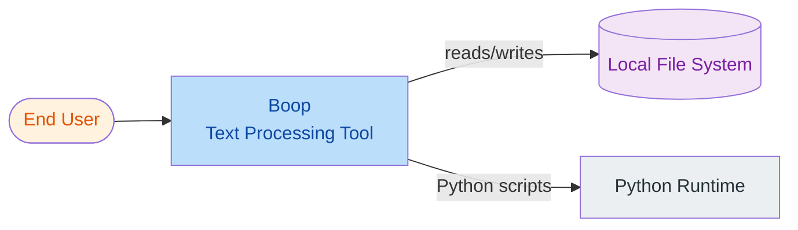
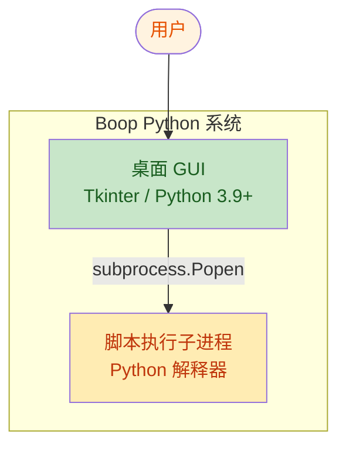
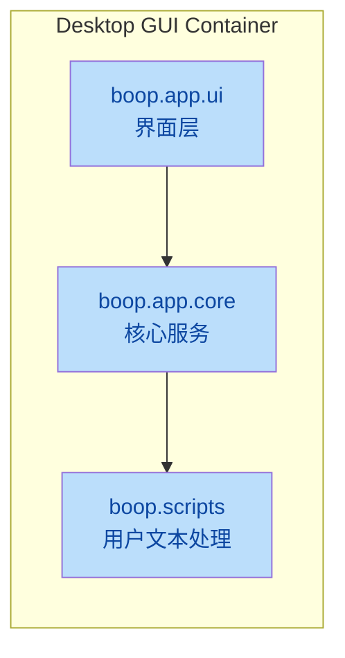
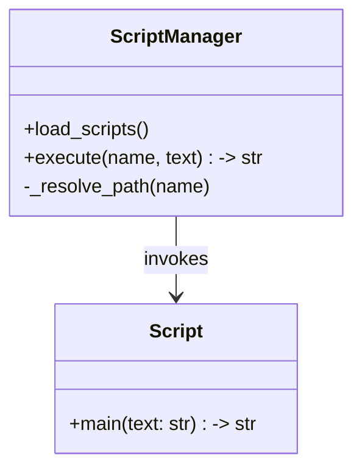

# C4 模型参考

C4 模型（Simon Brown）用四个缩放层级描述软件架构。对 Python 项目，各层级自然映射到语言的打包与模块体系。

## 层级映射（Python 视角）

| C4 层级 | Python 单元 | 示例 |
|---------|-------------|------|
| L1 上下文 | 整个系统作为一个盒子 | "Boop — 文本处理桌面应用" |
| L2 容器 | 可部署/可运行单元 | Tkinter GUI 应用、ASGI Web 服务、Celery worker、CLI 脚本、定时任务 |
| L3 组件 | 顶层包或子包 | `boop.app.ui`、`boop.app.core`、`boop.scripts` |
| L4 代码 | 模块 / 类 / 函数 | `editor.py`、`ScriptManager`、`ScriptManager.execute` |

## Level 1 — 系统上下文

**受众**：业务与技术干系人。**范围**：外部参与者与相邻系统。

必备内容：系统占一个盒子、外部人类参与者（带角色标签）、依赖的上游系统与被依赖的下游系统、必要时标注部署上下文（桌面 / on-prem / 云区域）。

## Level 2 — 容器

**受众**：开发者与运维。一个容器 = 一个独立进程、部署与技术栈的可部署/可运行单元。

### Python 常见容器类型及检测标记

| 容器类型 | 检测标记 |
|---------|---------|
| 桌面 GUI 应用 | `tkinter`、`PyQt`/`PySide`、`wx`、含 GUI 循环的 `__main__.py`、`.spec`（PyInstaller） |
| WSGI Web 应用 | `gunicorn`/`uwsgi`、`wsgi.py`、Flask `app.run`、Django `runserver` |
| ASGI Web 应用 | `uvicorn`/`hypercorn`/`daphne`、`asgi.py`、FastAPI/Starlette/aiohttp |
| 后台 worker | `celery`、`rq`、`dramatiq`、`arq`、`huey`、`apscheduler` |
| CLI 工具 | `console_scripts` 入口、`click`/`typer` group、`__main__` 中的 `argparse` |
| 定时任务 | cron 定义、`APScheduler`、`daemon` 标志 |
| 库 / SDK | `pyproject.toml` 无入口点；纯可导入包 |

每个容器必备内容：名称、技术（Python 版本 + 框架 + 服务器）、职责、入/出接口、所用数据存储。

## Level 3 — 组件

**受众**：开发者。对一个容器下钻。一个组件 = 一个顶层包或内聚子包。

每个组件需记录：用途、公共 API（`__all__`、`__init__.py` 导出）、入向依赖（导入了哪些其他组件）、被谁依赖（谁导入了它）。

## Level 4 — 代码（可选）

**受众**：某热点模块的维护者。类图或序列图谨慎使用 — 仅在结构非显然时画。

## Mermaid 配色规则（无障碍）

- `classDef` 必须同时给 `fill` 与 `color`（文字色）。
- 浅底用深字、深底用浅字。
- 推荐调色板：
  - Actor：`fill:#fff3e0,color:#e65100`
  - System：`fill:#bbdefb,color:#0d47a1`
  - Container：`fill:#c8e6c9,color:#1a5e20`
  - Component：`fill:#f3e5f5,color:#7b1fa2`
  - Store：`fill:#ffecb3,color:#bf360c`
  - External：`fill:#eceff1,color:#263238`
- 单张图节点数控制在 ~15 以内；宁可拆多张图，不要堆挤一张。
- 上下文/容器图优先 `flowchart LR`；组件分解优先 `flowchart TB`。

## Python 常见需标注的坑

- 同一容器混用 WSGI 与 ASGI 但未显式选定服务器。
- 同步代码调用异步库而未用 `asyncio.run` 或 `anyio` — 常见死锁源。
- `models` / `services` / `routers` 之间的循环导入。
- `__init__.py` 把所有符号全部重导出（公共 API 表面臃肿）。
- 裸 `except:` 或 `except Exception:` 静默吞错。
